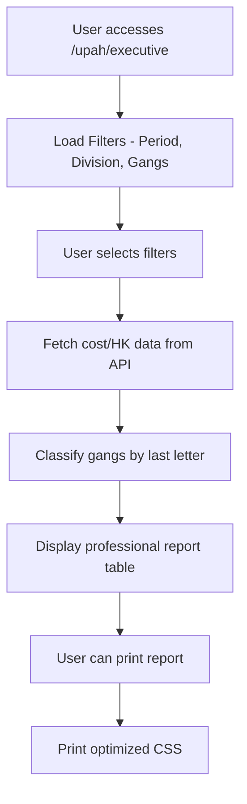

# Cost/HK Comparison Report Implementation Plan

## Overview
Create a professional Cost per Hari Kerja (HK) comparison report at `/upah/executive` with:
- Gang selection and filtering
- Classification by gang type (Harvesting/Transport/Maintenance)
- Division filter (non-IJL vs IJL)
- Print functionality
- Professional styling matching existing reports

## Architecture



## Gang Classification Logic
| Last Letter | Gang Type | Description |
|-------------|-----------|-------------|
| `H` | Harvesting | Panen/harvesting work |
| `T` | Transport | Transportation work |
| `M` | Maintenance | Maintenance work |
| Other | Uncategorized | Default/other |

## Implementation Steps

### Step 1: Backend API - New Endpoint
**File:** `backend/src/api/dashboardRoutes.ts`
- Add new endpoint: `GET /payroll/dashboard/cost-hk-comparison`
- Parameters: `month`, `year`, `division_filter`, `gang_codes[]`

**File:** `backend/src/services/dashboardService.ts`
- Add method: `getCostHKComparison(month, year, divisionFilter, gangCodes)`
- Query aggregation table with gang classification
- Calculate: `total_cost / total_hk = cost_per_hk`

### Step 2: Frontend - New Service
**File:** `frontend/src/services/costHKService.js`
- API call function for cost/HK comparison

### Step 3: Frontend - Report Component
**File:** `frontend/src/components/CostHKComparisonReport.jsx`
- Professional table layout (similar to `wages-summary-professional.css`)
- Filters: Period selector, Division selector (IJL/non-IJL), Gang multi-select
- Print button
- Export to Excel functionality

### Step 4: Update Executive Page
**File:** `frontend/src/pages/ExecutivePayrollPage.jsx`
- Add tab for "Cost/HK Comparison"
- Integrate the new component

### Step 5: Styling
**File:** `frontend/src/styles/cost-hk-report.css`
- Professional styling matching existing reports
- Print-optimized CSS
- Color coding by gang type

## Data Structure

### API Response
```json
{
  "success": true,
  "data": {
    "period": "Januari 2026",
    "division_filter": "ALL",
    "summary": {
      "harvesting": { "total_cost": 150000000, "total_hk": 5000, "cost_per_hk": 30000 },
      "transport": { "total_cost": 80000000, "total_hk": 2500, "cost_per_hk": 32000 },
      "maintenance": { "total_cost": 60000000, "total_hk": 2000, "cost_per_hk": 30000 },
      "uncategorized": { "total_cost": 10000000, "total_hk": 300, "cost_per_hk": 33333 }
    },
    "gang_details": [
      {
        "gang_code": "AB1AH",
        "gang_type": "harvesting",
        "division_code": "AB1",
        "total_cost": 5000000,
        "total_hk": 150,
        "cost_per_hk": 33333,
        "headcount": 25
      }
    ],
    "grand_total": {
      "total_cost": 300000000,
      "total_hk": 9800,
      "cost_per_hk": 30612
    }
  }
}
```

## UI Components

### Filters Section
- Month/Year selector
- Division filter (All, IJL, non-IJL)
- Gang multi-select dropdown with search
- Print button
- Export Excel button

### Report Table Columns
| Column | Description |
|--------|-------------|
| Gang Code | The gang identifier |
| Division | Division code |
| Gang Type | H/T/M classification |
| Total HK | Hari Kerja total |
| Total Cost | Total wages (Rp) |
| Cost/HK | Cost per Hari Kerja |
| Headcount | Number of workers |

### Summary Cards
- Total Cost (all divisions)
- Total HK
- Average Cost/HK
- Breakdown by gang type

## Files to Create/Modify

### New Files
1. `backend/src/services/costHKService.ts` - Backend service
2. `frontend/src/services/costHKService.js` - Frontend API service
3. `frontend/src/components/CostHKComparisonReport.jsx` - Main component
4. `frontend/src/styles/cost-hk-report.css` - Styling

### Modified Files
1. `backend/src/api/dashboardRoutes.ts` - Add new endpoint
2. `frontend/src/pages/ExecutivePayrollPage.jsx` - Add cost/HK tab

## Print Optimization
- Hide filters when printing
- Show company letterhead
- Landscape orientation
- Scale to fit
- Print-specific CSS classes

## Next Steps
1. Create backend service and API endpoint
2. Create frontend service
3. Build report component with filters
4. Apply professional styling
5. Add print functionality
6. Test and validate
