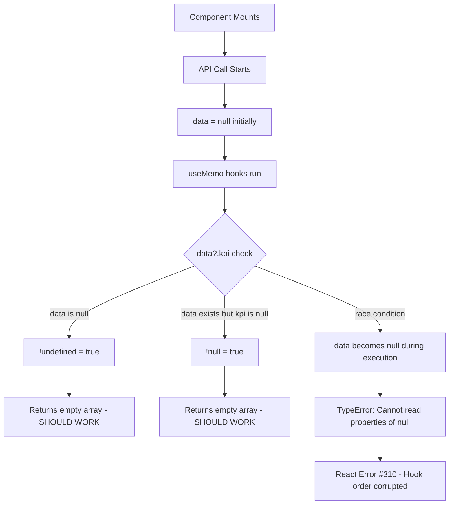

# Fix Plan: ExecutivePayrollPage Errors

## Problem Summary

When opening the `/upah/executive` route, the application throws multiple errors:

1. **TypeError: Cannot read properties of null (reading 'kpi')** - Occurs in a `useMemo` hook
2. **React Error #310** - "Rendered more hooks than during the previous render"
3. **Chart dimension warning** - "The width(-1) and height(-1) of chart should be greater than 0"

## Root Cause Analysis

### Issue 1: TypeError in useMemo

**Location**: [`ExecutivePayrollPage.jsx`](frontend/src/pages/ExecutivePayrollPage.jsx:460) - `costComposition` useMemo

**Current Code**:
```javascript
const costComposition = useMemo(() => {
    if (!data?.kpi) return [];
    const wage = data.kpi.curr_wage || 0;
    const ot = data.kpi.curr_ot || 0;
    return [
        { name: 'Overtime', value: ot, color: '#f59e0b' },
        { name: 'Regular Pay & Premi', value: Math.max(0, wage - ot), color: '#3b82f6' }
    ];
}, [data]);
```

**Problem**: The guard `if (!data?.kpi)` uses optional chaining which returns `undefined` when `data` is `null`. However, `!undefined` is `true`, so the guard should work. The issue is likely a race condition where:
1. `data` is initially `null`
2. The component renders before the API call completes
3. The useMemo runs with `data = null`
4. The guard passes but subsequent access fails

**Additional Issue**: The dependency array is `[data]` but the function accesses `data.kpi`. If `data` changes reference but `data.kpi` is still null, the useMemo will re-run and fail.

### Issue 2: React Error #310

**Cause**: This error occurs when hooks are called conditionally or in a different order between renders. The error stack trace shows it's related to `useMemo`.

**Potential Cause**: When the TypeError is thrown inside a useMemo, React's internal hook tracking gets corrupted, leading to this error on subsequent renders.

### Issue 3: Chart Dimension Warning

**Location**: Recharts ResponsiveContainer components

**Cause**: The chart container has no dimensions when it first renders because:
1. The parent container may not have explicit dimensions
2. The component renders before CSS is fully applied
3. The chart tries to measure its container before layout is complete

## Proposed Fixes

### Fix 1: Strengthen null checks in useMemo hooks

**File**: [`frontend/src/pages/ExecutivePayrollPage.jsx`](frontend/src/pages/ExecutivePayrollPage.jsx)

**Changes Required**:

1. **Line 460-469** - `costComposition` useMemo:
```javascript
// BEFORE
const costComposition = useMemo(() => {
    if (!data?.kpi) return [];
    const wage = data.kpi.curr_wage || 0;
    const ot = data.kpi.curr_ot || 0;
    return [
        { name: 'Overtime', value: ot, color: '#f59e0b' },
        { name: 'Regular Pay & Premi', value: Math.max(0, wage - ot), color: '#3b82f6' }
    ];
}, [data]);

// AFTER
const costComposition = useMemo(() => {
    if (!data || !data.kpi) return [];
    const wage = data.kpi.curr_wage || 0;
    const ot = data.kpi.curr_ot || 0;
    return [
        { name: 'Overtime', value: ot, color: '#f59e0b' },
        { name: 'Regular Pay & Premi', value: Math.max(0, wage - ot), color: '#3b82f6' }
    ];
}, [data?.kpi]);
```

2. **Line 381-404** - `divisionChartData` useMemo:
```javascript
// BEFORE
const divisionChartData = useMemo(() => {
    if (!data?.breakdown) return [];
    // ... rest of code
}, [data]);

// AFTER
const divisionChartData = useMemo(() => {
    if (!data || !data.breakdown) return [];
    // ... rest of code
}, [data?.breakdown]);
```

3. **Line 406-413** - `gangChartData` useMemo:
```javascript
// BEFORE
const gangChartData = useMemo(() => {
    if (!data?.gangBreakdown) return [];
    // ... rest of code
}, [data?.gangBreakdown]);

// AFTER  
const gangChartData = useMemo(() => {
    if (!data || !data.gangBreakdown) return [];
    // ... rest of code
}, [data?.gangBreakdown]);
```

4. **Line 416-428** - `overtimeChartData` useMemo:
```javascript
// BEFORE
const overtimeChartData = useMemo(() => {
    if (!data?.breakdown) return [];
    // ... rest of code
}, [data?.breakdown]);

// AFTER
const overtimeChartData = useMemo(() => {
    if (!data || !data.breakdown) return [];
    // ... rest of code
}, [data?.breakdown]);
```

5. **Line 440-448** - `efficiencyData` useMemo:
```javascript
// BEFORE
const efficiencyData = useMemo(() => {
    if (!data?.efficiency) return [];
    // ... rest of code
}, [data?.efficiency]);

// AFTER
const efficiencyData = useMemo(() => {
    if (!data || !data.efficiency) return [];
    // ... rest of code
}, [data?.efficiency]);
```

6. **Line 450-453** - `productivityData` useMemo:
```javascript
// BEFORE
const productivityData = useMemo(() => {
    if (!data?.productivityTrend) return [];
    return data.productivityTrend;
}, [data?.productivityTrend]);

// AFTER
const productivityData = useMemo(() => {
    if (!data || !data.productivityTrend) return [];
    return data.productivityTrend;
}, [data?.productivityTrend]);
```

7. **Line 455-458** - `wageSpikes` useMemo:
```javascript
// BEFORE
const wageSpikes = useMemo(() => {
    if (!data?.wageSpikes) return [];
    return data.wageSpikes;
}, [data?.wageSpikes]);

// AFTER
const wageSpikes = useMemo(() => {
    if (!data || !data.wageSpikes) return [];
    return data.wageSpikes;
}, [data?.wageSpikes]);
```

### Fix 2: Add chart container dimensions

**Location**: Multiple ResponsiveContainer components

**Changes Required**:

Add `minWidth` and `minHeight` props to ResponsiveContainer components, or ensure parent containers have explicit dimensions:

```javascript
// Example fix for Line 675-695
<div style={{ height: '350px', width: '100%', minHeight: '200px' }}>
    <ResponsiveContainer width="100%" height="100%" minWidth={200} minHeight={200}>
        <AreaChart data={trends} margin={{ top: 10, right: 30, left: 0, bottom: 0 }}>
            {/* ... chart content ... */}
        </AreaChart>
    </ResponsiveContainer>
</div>
```

### Fix 3: Add early return guard before useMemo hooks

**Alternative Approach**: Move the early return checks before the useMemo hooks to prevent them from running with null data.

**Note**: This would violate React's rules of hooks, as hooks must be called in the same order on every render. **Do not implement this approach.**

## Implementation Steps

1. [ ] Update `costComposition` useMemo with stronger null check and correct dependency
2. [ ] Update `divisionChartData` useMemo with stronger null check
3. [ ] Update `gangChartData` useMemo with stronger null check
4. [ ] Update `overtimeChartData` useMemo with stronger null check
5. [ ] Update `efficiencyData` useMemo with stronger null check
6. [ ] Update `productivityData` useMemo with stronger null check
7. [ ] Update `wageSpikes` useMemo with stronger null check
8. [ ] Add minWidth/minHeight props to ResponsiveContainer components
9. [ ] Test the fixes by navigating to `/upah/executive`

## Testing Plan

1. Navigate to `/upah/executive` route
2. Verify no TypeError in console
3. Verify no React Error #310 in console
4. Verify charts render correctly
5. Test with different period selections
6. Test with different division/gang filters

## Diagram: Error Flow



## Risk Assessment

- **Low Risk**: The useMemo null check changes are defensive and won't break existing functionality
- **Medium Risk**: Chart dimension changes may affect layout, need visual verification
- **No Risk**: No database or API changes required