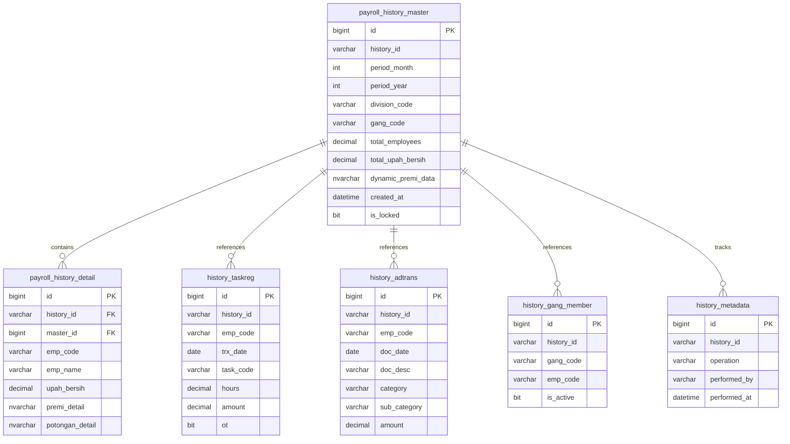
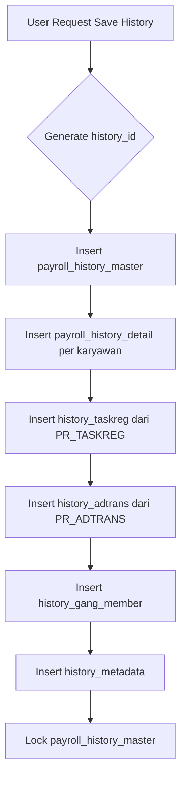
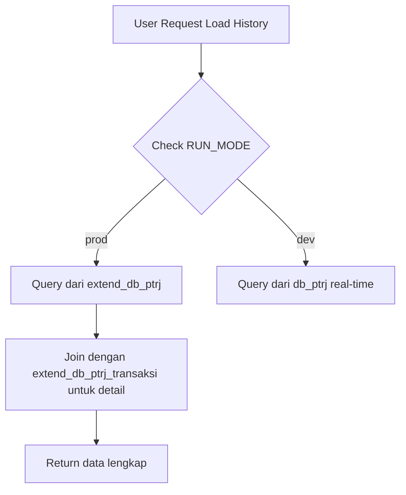

# Skema Database History untuk Daftar Upah

## Ringkasan

Dokumen ini mendefinisikan skema database untuk menyimpan data history transaksi payroll dan daftar upah. Sistem ini mendukung dua mode operasi:
- **Mode Production (RUN_MODE=prod)**: Menggunakan database terpisah untuk history
- **Mode Development (RUN_MODE=dev)**: Menggunakan database utama

## Konfigurasi Database

### Environment Variables (.env)
```env
RUN_MODE=prod  # atau dev

# Database Utama (Payroll Real-time)
DB_DATABASE=db_ptrj

# Database Extended (History Aggregation)
DB_EXTEND_DATABASE=extend_db_ptrj

# Database Transaksi (History Detail Transaksi)
DB_EXTEND_TRANS_DATABASE=extend_db_ptrj_transaksi
```

### Database Routing Logic

```typescript
// Logic pemilihan database berdasarkan RUN_MODE
if (Config.RUN_MODE === 'prod' && isHistoryData) {
    // Payroll/Daftar Upah History -> extend_db_ptrj
    db = Database.getInstance(Config.DB_EXTEND_DATABASE, Config.DB_PROFILE);
    
    // Detail Transaksi (Taskreg, ADTrans) -> extend_db_ptrj_transaksi
    transDb = Database.getInstance(Config.DB_EXTEND_TRANS_DATABASE, Config.DB_PROFILE);
} else {
    // Mode dev atau data real-time -> db_ptrj
    db = Database.getInstance(Config.DEFAULT_DATABASE, Config.DB_PROFILE);
}
```

## Skema Tabel

### 1. Tabel History Master (extend_db_ptrj)

#### `payroll_history_master`
Tabel ini menyimpan header/summary dari setiap periode payroll yang di-archive.

```sql
CREATE TABLE [dbo].[payroll_history_master] (
    [id] [bigint] IDENTITY(1,1) NOT NULL,
    [history_id] [varchar](50) NOT NULL,              -- UUID untuk grouping
    [period_month] [int] NOT NULL,
    [period_year] [int] NOT NULL,
    [division_code] [varchar](50) NOT NULL,
    [gang_code] [varchar](50) NOT NULL,
    [gang_description] [nvarchar](255) NULL,
    
    -- Summary Data
    [total_employees] [int] NOT NULL DEFAULT 0,
    [total_hk] [decimal](18, 2) NOT NULL DEFAULT 0,
    [total_hari_kerja] [decimal](18, 2) NOT NULL DEFAULT 0,
    [total_cuti_tahunan] [decimal](18, 2) NOT NULL DEFAULT 0,
    [total_cuti_sakit] [decimal](18, 2) NOT NULL DEFAULT 0,
    [total_cuti_minggu] [decimal](18, 2) NOT NULL DEFAULT 0,
    [total_cuti_nasional] [decimal](18, 2) NOT NULL DEFAULT 0,
    
    -- Upah
    [total_upah_dasar] [decimal](18, 2) NOT NULL DEFAULT 0,
    [total_upah_pokok] [decimal](18, 2) NOT NULL DEFAULT 0,
    [total_gaji_pokok] [decimal](18, 2) NOT NULL DEFAULT 0,
    
    -- Tunjangan
    [total_beras] [decimal](18, 2) NOT NULL DEFAULT 0,
    [total_jabatan] [decimal](18, 2) NOT NULL DEFAULT 0,
    [total_masa_kerja] [decimal](18, 2) NOT NULL DEFAULT 0,
    [total_lembur] [decimal](18, 2) NOT NULL DEFAULT 0,
    [total_tunjangan] [decimal](18, 2) NOT NULL DEFAULT 0,
    
    -- Premi
    [total_premi_brondol] [decimal](18, 2) NOT NULL DEFAULT 0,
    [total_premi_prunning] [decimal](18, 2) NOT NULL DEFAULT 0,
    [total_premi_insentif] [decimal](18, 2) NOT NULL DEFAULT 0,
    [total_premi_kinerja] [decimal](18, 2) NOT NULL DEFAULT 0,
    [total_premi] [decimal](18, 2) NOT NULL DEFAULT 0,
    [dynamic_premi_data] [nvarchar](max) NULL,        -- JSON array
    
    -- Potongan
    [total_koreksi] [decimal](18, 2) NOT NULL DEFAULT 0,
    [total_potongan] [decimal](18, 2) NOT NULL DEFAULT 0,
    [total_pph21] [decimal](18, 2) NOT NULL DEFAULT 0,
    [total_bpjs_pekerja] [decimal](18, 2) NOT NULL DEFAULT 0,
    [total_bpjs_majikan] [decimal](18, 2) NOT NULL DEFAULT 0,
    [total_spsi] [decimal](18, 2) NOT NULL DEFAULT 0,
    [dynamic_potongan_data] [nvarchar](max) NULL,     -- JSON array
    
    -- Total Akhir
    [total_upah_kotor] [decimal](18, 2) NOT NULL DEFAULT 0,
    [total_upah_bersih] [decimal](18, 2) NOT NULL DEFAULT 0,
    
    -- Metadata
    [total_ffb_weight] [decimal](18, 2) NULL,
    [total_weight_tbs] [decimal](18, 2) NULL,
    [informasi_tambahan] [nvarchar](max) NULL,
    
    -- Audit
    [created_at] [datetime] NOT NULL DEFAULT GETDATE(),
    [created_by] [varchar](100) NULL,
    [source_endpoint] [varchar](255) NULL,
    [is_locked] [bit] NOT NULL DEFAULT 0,             -- Prevent modification
    [lock_reason] [nvarchar](500) NULL,
    
    CONSTRAINT [PK_payroll_history_master] PRIMARY KEY CLUSTERED ([id] ASC),
    CONSTRAINT [UQ_payroll_history_master] UNIQUE NONCLUSTERED ([history_id], [gang_code])
);

-- Indexes
CREATE NONCLUSTERED INDEX [IX_payroll_history_master_period] 
    ON [dbo].[payroll_history_master] ([period_year], [period_month]);
    
CREATE NONCLUSTERED INDEX [IX_payroll_history_master_division] 
    ON [dbo].[payroll_history_master] ([division_code]);
    
CREATE NONCLUSTERED INDEX [IX_payroll_history_master_gang] 
    ON [dbo].[payroll_history_master] ([gang_code]);
```

### 2. Tabel History Detail Karyawan (extend_db_ptrj)

#### `payroll_history_detail`
Tabel ini menyimpan detail per karyawan untuk setiap history.

```sql
CREATE TABLE [dbo].[payroll_history_detail] (
    [id] [bigint] IDENTITY(1,1) NOT NULL,
    [history_id] [varchar](50) NOT NULL,              -- FK ke payroll_history_master
    [master_id] [bigint] NOT NULL,                    -- FK ke payroll_history_master.id
    
    -- Identitas Karyawan
    [emp_code] [varchar](50) NOT NULL,
    [emp_name] [nvarchar](255) NULL,
    [nik] [varchar](50) NULL,
    [gender] [varchar](10) NULL,
    [gang_code] [varchar](50) NOT NULL,
    [division_code] [varchar](50) NOT NULL,
    [loc_code] [varchar](50) NULL,
    [status_ptkp] [varchar](20) NULL,
    [kategori_ter] [varchar](20) NULL,
    
    -- Absensi
    [hari_kerja] [decimal](18, 2) NOT NULL DEFAULT 0,
    [cuti_tahunan_hari] [decimal](18, 2) NOT NULL DEFAULT 0,
    [cuti_sakit_haid_hari] [decimal](18, 2) NOT NULL DEFAULT 0,
    [cuti_minggu_hari] [decimal](18, 2) NOT NULL DEFAULT 0,
    [cuti_nasional_hari] [decimal](18, 2) NOT NULL DEFAULT 0,
    [jumlah_hk] [decimal](18, 2) NOT NULL DEFAULT 0,
    [total_jam_kerja] [decimal](18, 2) NOT NULL DEFAULT 0,
    
    -- Upah
    [upah_dasar] [decimal](18, 2) NOT NULL DEFAULT 0,
    [upah_pokok] [decimal](18, 2) NOT NULL DEFAULT 0,
    [gaji_pokok] [decimal](18, 2) NOT NULL DEFAULT 0,
    [gaji_pokok_ideal] [decimal](18, 2) NOT NULL DEFAULT 0,
    [gaji_pokok_aktual] [decimal](18, 2) NOT NULL DEFAULT 0,
    [koreksi_hk] [decimal](18, 2) NOT NULL DEFAULT 0,
    
    -- Tunjangan
    [beras_rate] [decimal](18, 2) NOT NULL DEFAULT 0,
    [beras_jumlah] [decimal](18, 2) NOT NULL DEFAULT 0,
    [jabatan_rate] [decimal](18, 2) NOT NULL DEFAULT 0,
    [jabatan_jumlah] [decimal](18, 2) NOT NULL DEFAULT 0,
    [masa_kerja_tahun] [int] NOT NULL DEFAULT 0,
    [masa_kerja_rate] [decimal](18, 2) NOT NULL DEFAULT 0,
    [masa_kerja_jumlah] [decimal](18, 2) NOT NULL DEFAULT 0,
    [lembur_jam] [decimal](18, 2) NOT NULL DEFAULT 0,
    [lembur_rate] [decimal](18, 2) NOT NULL DEFAULT 0,
    [lembur_jumlah] [decimal](18, 2) NOT NULL DEFAULT 0,
    [lembur_records] [nvarchar](max) NULL,            -- JSON detail lembur
    [total_tunjangan] [decimal](18, 2) NOT NULL DEFAULT 0,
    
    -- Premi
    [premi_brondol] [decimal](18, 2) NOT NULL DEFAULT 0,
    [premi_pph] [decimal](18, 2) NOT NULL DEFAULT 0,
    [total_premi] [decimal](18, 2) NOT NULL DEFAULT 0,
    [premi_detail] [nvarchar](max) NULL,              -- JSON array detail premi
    
    -- Potongan
    [pot_spsi] [decimal](18, 2) NOT NULL DEFAULT 0,
    [pot_pph21] [decimal](18, 2) NOT NULL DEFAULT 0,
    [pot_koreksi] [decimal](18, 2) NOT NULL DEFAULT 0,
    [pot_bpjs_kesehatan_pekerja] [decimal](18, 2) NOT NULL DEFAULT 0,
    [pot_bpjs_kesehatan_majikan] [decimal](18, 2) NOT NULL DEFAULT 0,
    [pot_bpjs_pensiun_pekerja] [decimal](18, 2) NOT NULL DEFAULT 0,
    [pot_bpjs_pensiun_majikan] [decimal](18, 2) NOT NULL DEFAULT 0,
    [pot_bpjs_pekerja_total] [decimal](18, 2) NOT NULL DEFAULT 0,
    [pot_astek_pekerja] [decimal](18, 2) NOT NULL DEFAULT 0,
    [pot_astek_majikan] [decimal](18, 2) NOT NULL DEFAULT 0,
    [pot_astek_jumlah] [decimal](18, 2) NOT NULL DEFAULT 0,
    [potongan_detail] [nvarchar](max) NULL,           -- JSON array detail potongan
    [total_potongan] [decimal](18, 2) NOT NULL DEFAULT 0,
    [total_potongan_bersih] [decimal](18, 2) NOT NULL DEFAULT 0,
    
    -- Total Akhir
    [jumlah_upah_kotor] [decimal](18, 2) NOT NULL DEFAULT 0,
    [upah_kotor_pajak] [decimal](18, 2) NOT NULL DEFAULT 0,
    [penghasilan_bruto] [decimal](18, 2) NOT NULL DEFAULT 0,
    [tarif_pajak_ter] [decimal](5, 2) NULL,
    [pph21_ter] [decimal](18, 2) NOT NULL DEFAULT 0,
    [upah_bersih] [decimal](18, 2) NOT NULL DEFAULT 0,
    
    -- Metadata
    [task_code] [varchar](50) NULL,
    [task_desc] [nvarchar](255) NULL,
    [shortage_details] [nvarchar](max) NULL,          -- JSON array
    [shortage_total_hours] [decimal](18, 2) NULL,
    
    -- Audit
    [created_at] [datetime] NOT NULL DEFAULT GETDATE(),
    
    CONSTRAINT [PK_payroll_history_detail] PRIMARY KEY CLUSTERED ([id] ASC),
    CONSTRAINT [FK_payroll_history_detail_master] FOREIGN KEY ([master_id]) 
        REFERENCES [dbo].[payroll_history_master] ([id]) ON DELETE CASCADE
);

-- Indexes
CREATE NONCLUSTERED INDEX [IX_payroll_history_detail_history_id] 
    ON [dbo].[payroll_history_detail] ([history_id]);
    
CREATE NONCLUSTERED INDEX [IX_payroll_history_detail_emp] 
    ON [dbo].[payroll_history_detail] ([emp_code]);
    
CREATE NONCLUSTERED INDEX [IX_payroll_history_detail_gang] 
    ON [dbo].[payroll_history_detail] ([gang_code]);
```

### 3. Tabel History Transaksi Taskreg (extend_db_ptrj_transaksi)

#### `history_taskreg`
Menyimpan data transaksi absensi/kehadiran dari PR_TASKREG dan PR_TASKREGLN.

```sql
CREATE TABLE [dbo].[history_taskreg] (
    [id] [bigint] IDENTITY(1,1) NOT NULL,
    [history_id] [varchar](50) NOT NULL,              -- Grouping dengan payroll_history
    
    -- Data dari PR_TASKREG
    [original_master_id] [bigint] NULL,               -- ID asli dari PR_TASKREG (jika ada)
    [reg_no] [varchar](50) NULL,
    [reg_date] [datetime] NULL,
    [emp_code] [varchar](50) NOT NULL,
    [gang_code] [varchar](50) NULL,
    [division_code] [varchar](50) NULL,
    
    -- Data dari PR_TASKREGLN
    [original_line_id] [bigint] NULL,                 -- ID asli dari PR_TASKREGLN (jika ada)
    [line_no] [int] NULL,
    [trx_date] [date] NOT NULL,
    [task_code] [varchar](50) NULL,
    [task_desc] [nvarchar](255) NULL,
    [hours] [decimal](18, 2) NOT NULL DEFAULT 0,
    [ot] [bit] NOT NULL DEFAULT 0,                    -- Overtime flag
    [rate] [decimal](18, 2) NULL,
    [amount] [decimal](18, 2) NOT NULL DEFAULT 0,
    [tapping_type] [varchar](50) NULL,
    [location_code] [varchar](50) NULL,
    [status] [varchar](50) NULL,
    
    -- Kategori
    [is_cuti_tahunan] [bit] NOT NULL DEFAULT 0,
    [is_cuti_sakit] [bit] NOT NULL DEFAULT 0,
    [is_cuti_minggu] [bit] NOT NULL DEFAULT 0,
    [is_cuti_nasional] [bit] NOT NULL DEFAULT 0,
    [is_hari_kerja] [bit] NOT NULL DEFAULT 0,
    
    -- Metadata
    [period_month] [int] NOT NULL,
    [period_year] [int] NOT NULL,
    [created_at] [datetime] NOT NULL DEFAULT GETDATE(),
    [source_table] [varchar](50) NOT NULL,            -- 'PR_TASKREG' atau 'PR_TASKREG_ARC'
    
    CONSTRAINT [PK_history_taskreg] PRIMARY KEY CLUSTERED ([id] ASC)
);

-- Indexes
CREATE NONCLUSTERED INDEX [IX_history_taskreg_history_id] 
    ON [dbo].[history_taskreg] ([history_id]);
    
CREATE NONCLUSTERED INDEX [IX_history_taskreg_emp] 
    ON [dbo].[history_taskreg] ([emp_code], [period_year], [period_month]);
    
CREATE NONCLUSTERED INDEX [IX_history_taskreg_date] 
    ON [dbo].[history_taskreg] ([trx_date]);
    
CREATE NONCLUSTERED INDEX [IX_history_taskreg_period] 
    ON [dbo].[history_taskreg] ([period_year], [period_month]);
```

### 4. Tabel History Transaksi ADTrans (extend_db_ptrj_transaksi)

#### `history_adtrans`
Menyimpan data transaksi tunjangan/potongan/premi dari PR_ADTRANS dan PR_ADTRANSLN.

```sql
CREATE TABLE [dbo].[history_adtrans] (
    [id] [bigint] IDENTITY(1,1) NOT NULL,
    [history_id] [varchar](50) NOT NULL,              -- Grouping dengan payroll_history
    
    -- Data dari PR_ADTRANS
    [original_master_id] [bigint] NULL,               -- ID asli dari PR_ADTRANS
    [doc_no] [varchar](50) NULL,
    [doc_date] [date] NOT NULL,
    [doc_desc] [nvarchar](500) NULL,                  -- Deskripsi dokumen
    [emp_code] [varchar](50) NOT NULL,
    [gang_code] [varchar](50) NULL,
    [division_code] [varchar](50) NULL,
    
    -- Data dari PR_ADTRANSLN
    [original_line_id] [bigint] NULL,                 -- ID asli dari PR_ADTRANSLN
    [line_no] [int] NULL,
    [task_code] [varchar](50) NULL,
    [task_desc] [nvarchar](255) NULL,
    [amount] [decimal](18, 2) NOT NULL DEFAULT 0,
    [quantity] [decimal](18, 2) NULL,
    [uom] [varchar](50) NULL,
    
    -- Kategori (diklasifikasikan saat insert)
    [category] [varchar](50) NOT NULL,                -- 'TUNJANGAN', 'POTONGAN', 'PREMI'
    [sub_category] [varchar](100) NULL,               -- 'BERAS', 'JABATAN', 'MASA_KERJA', 'LEMBUR', 'BRONDOL', 'PPH21', 'SPSI', 'BPJS', 'KOREKSI', dll
    [is_dynamic] [bit] NOT NULL DEFAULT 0,            -- Apakah ini dynamic header
    [dynamic_header_name] [nvarchar](255) NULL,       -- Nama header jika dynamic
    
    -- Flag khusus
    [is_premi_pph] [bit] NOT NULL DEFAULT 0,          -- TaskDesc = 'ACCRUALS-CHECKROLL'
    [is_koreksi] [bit] NOT NULL DEFAULT 0,            -- DocDesc mengandung 'KOREKSI'
    [is_potongan] [bit] NOT NULL DEFAULT 0,           -- DocDesc mengandung 'POT' atau 'POTONGAN'
    
    -- Metadata
    [period_month] [int] NOT NULL,
    [period_year] [int] NOT NULL,
    [created_at] [datetime] NOT NULL DEFAULT GETDATE(),
    [source_table] [varchar](50) NOT NULL,            -- 'PR_ADTRANS' atau 'PR_ADTRANS_ARC'
    
    CONSTRAINT [PK_history_adtrans] PRIMARY KEY CLUSTERED ([id] ASC)
);

-- Indexes
CREATE NONCLUSTERED INDEX [IX_history_adtrans_history_id] 
    ON [dbo].[history_adtrans] ([history_id]);
    
CREATE NONCLUSTERED INDEX [IX_history_adtrans_emp] 
    ON [dbo].[history_adtrans] ([emp_code], [period_year], [period_month]);
    
CREATE NONCLUSTERED INDEX [IX_history_adtrans_category] 
    ON [dbo].[history_adtrans] ([category], [sub_category]);
    
CREATE NONCLUSTERED INDEX [IX_history_adtrans_period] 
    ON [dbo].[history_adtrans] ([period_year], [period_month]);
    
CREATE NONCLUSTERED INDEX [IX_history_adtrans_doc_date] 
    ON [dbo].[history_adtrans] ([doc_date]);
```

### 5. Tabel History Gang Member (extend_db_ptrj_transaksi)

#### `history_gang_member`
Menyimpan data keanggotaan gang per periode.

```sql
CREATE TABLE [dbo].[history_gang_member] (
    [id] [bigint] IDENTITY(1,1) NOT NULL,
    [history_id] [varchar](50) NOT NULL,
    
    -- Data Gang
    [gang_code] [varchar](50) NOT NULL,
    [gang_description] [nvarchar](255) NULL,
    [division_code] [varchar](50) NOT NULL,
    [loc_code] [varchar](50) NULL,
    
    -- Data Karyawan
    [emp_code] [varchar](50) NOT NULL,
    [emp_name] [nvarchar](255) NULL,
    [join_date] [date] NULL,
    [is_active] [bit] NOT NULL DEFAULT 1,
    
    -- Metadata
    [period_month] [int] NOT NULL,
    [period_year] [int] NOT NULL,
    [created_at] [datetime] NOT NULL DEFAULT GETDATE(),
    [source_table] [varchar](50) NOT NULL,            -- 'HR_GANGLN' atau 'PR_GANGLN_ARC'
    
    CONSTRAINT [PK_history_gang_member] PRIMARY KEY CLUSTERED ([id] ASC)
);

-- Indexes
CREATE NONCLUSTERED INDEX [IX_history_gang_member_history_id] 
    ON [dbo].[history_gang_member] ([history_id]);
    
CREATE NONCLUSTERED INDEX [IX_history_gang_member_emp] 
    ON [dbo].[history_gang_member] ([emp_code], [period_year], [period_month]);
    
CREATE NONCLUSTERED INDEX [IX_history_gang_member_gang] 
    ON [dbo].[history_gang_member] ([gang_code]);
```

### 6. Tabel Metadata History (extend_db_ptrj_transaksi)

#### `history_metadata`
Tracking semua operasi history (create, update, delete).

```sql
CREATE TABLE [dbo].[history_metadata] (
    [id] [bigint] IDENTITY(1,1) NOT NULL,
    [history_id] [varchar](50) NOT NULL,              -- UUID grouping
    [operation] [varchar](50) NOT NULL,               -- 'CREATE', 'UPDATE', 'DELETE', 'LOCK', 'UNLOCK'
    [entity_type] [varchar](50) NOT NULL,             -- 'PAYROLL_MASTER', 'PAYROLL_DETAIL', 'TASKREG', 'ADTRANS', 'GANG_MEMBER'
    [entity_id] [bigint] NULL,                        -- ID spesifik entity (jika ada)
    
    -- Data Period
    [period_month] [int] NOT NULL,
    [period_year] [int] NOT NULL,
    [division_code] [varchar](50) NULL,
    [gang_code] [varchar](50) NULL,
    
    -- Detail Operasi
    [description] [nvarchar](1000) NULL,
    [old_values] [nvarchar](max) NULL,                -- JSON (untuk UPDATE)
    [new_values] [nvarchar](max) NULL,                -- JSON
    [record_count] [int] NULL,                        -- Jumlah record yang terpengaruh
    
    -- Audit
    [performed_by] [varchar](100) NOT NULL,
    [performed_at] [datetime] NOT NULL DEFAULT GETDATE(),
    [ip_address] [varchar](50) NULL,
    [user_agent] [varchar](500) NULL,
    
    CONSTRAINT [PK_history_metadata] PRIMARY KEY CLUSTERED ([id] ASC)
);

-- Indexes
CREATE NONCLUSTERED INDEX [IX_history_metadata_history_id] 
    ON [dbo].[history_metadata] ([history_id]);
    
CREATE NONCLUSTERED INDEX [IX_history_metadata_period] 
    ON [dbo].[history_metadata] ([period_year], [period_month]);
    
CREATE NONCLUSTERED INDEX [IX_history_metadata_operation] 
    ON [dbo].[history_metadata] ([operation], [performed_at]);
```

## Entity Relationship Diagram



## Alur Kerja Sistem

### 1. Menyimpan History (Save)



### 2. Membaca History (Load)



## Keuntungan Skema Ini

1. **Data Integrity**: Semua data tersimpan lengkap, tidak ada yang hilang
2. **Traceability**: Bisa tracking siapa yang menyimpan, kapan, dan apa yang berubah
3. **Performance**: Query history lebih cepat karena tidak perlu join banyak tabel real-time
4. **Separation of Concerns**: Data summary di extend_db_ptrj, detail transaksi di extend_db_ptrj_transaksi
5. **Audit Trail**: Tabel metadata mencatat semua operasi
6. **Locking Mechanism**: Data history bisa di-lock untuk mencegah modifikasi

## Migration Script

Lihat file:
- `migrations/001_create_payroll_history_tables.sql`
- `migrations/002_create_transaction_history_tables.sql`
- `migrations/003_create_history_metadata_table.sql`
