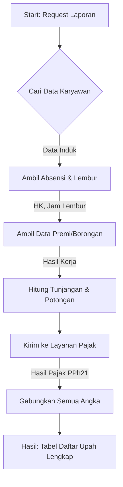
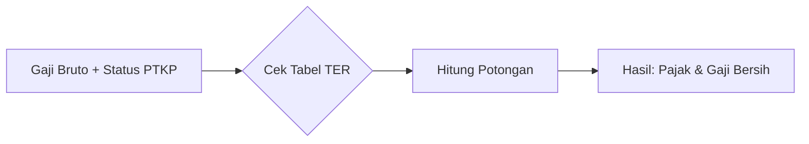

# Detail Proses Internal Layanan (Deep Dive)

Dokumen ini menjelaskan apa yang terjadi "di dalam mesin" setiap layanan utama, terutama bagaimana **Daftar Upah** disusun.

---

## 1. Layanan: Daftar Upah (Aggregation Upah)
Layanan ini adalah "Koki Utama" yang meramu semua bahan menjadi satu laporan besar.

### Diagram Alur Kerja:

### Apa yang Terjadi di Dalamnya?
1.  **Pengumpulan Bahan (Data Gathering):** Sistem mengambil data dari berbagai "laci" (tabel database): data pribadi, jabatan, dan di grup (gang) mana dia bekerja.
2.  **Perhitungan Menit ke Jam (Attendance Logic):** Mengonversi data absensi mentah menjadi jumlah Hari Kerja (HK) dan jam Lembur.
3.  **Rumus Gaji (Wage Calculation):**
    *   `Gaji Pokok = HK * Tarif`
    *   `Lembur = Jam * Koefisien`
    *   `Total Bruto = Pokok + Lembur + Premi + Tunjangan`
4.  **Validasi Pajak:** Sebelum laporan selesai, angka kotor (Bruto) dikirim ke "Divisi Pajak" untuk tahu berapa potongan resminya.

---

## 2. Layanan: Hitung Pajak (PPh21)
Layanan ini adalah "Akuntan Spesialis" yang memastikan potongan pajak sesuai aturan pemerintah (TER/Tarif Efektif Rata-rata).

### Diagram Alur Kerja:

### Apa yang Terjadi di Dalamnya?
1.  **Identifikasi Status:** Mengecek apakah karyawan sudah menikah atau punya anak (PTKP: K/0, K/1, dll).
2.  **Pencocokan Tabel:** Mencari di tabel aturan pemerintah terbaru, jika gaji Rp 10jt dengan status K/1, berapa persen pajaknya.
3.  **Hasil Instan:** Memberikan jawaban angka pajak kembali ke layanan Daftar Upah.

---

## 3. Layanan: Query Gateway
Ini adalah "Pintu Gerbang" pintar untuk mengambil data dalam jumlah besar tanpa membuat sistem macet.

### Apa yang Terjadi di Dalamnya?
1.  **Antrian Data:** Jika ada 1000 karyawan, dia tidak mengambil satu-satu, tapi dalam satu "keranjang" besar (Batch Processing).
2.  **Penyaringan (Filtering):** Memastikan hanya data yang diminta (misal: hanya Divisi A) yang diambil dari gudang data.

---

## Ringkasan Peran:
| Layanan | Analoginya | Hasil Akhirnya |
|:---|:---|:---|
| **Daftar Upah** | **Koki Utama** | Laporan satu baris per karyawan dengan semua rincian uangnya. |
| **Hitung Pajak** | **Kalkulator Resmi** | Angka potongan PPh21 yang sah. |
| **Gateway** | **Logistik** | Pengiriman data yang cepat dan efisien dari database. |
