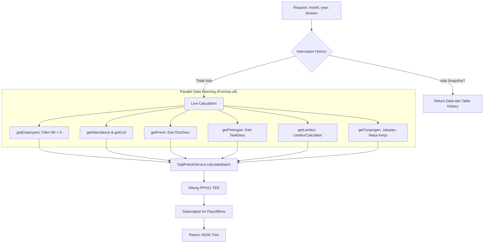
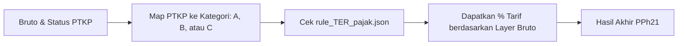

# Detail Teknis Arsitektur & Alur Payroll (Based on Code)

Dokumen ini disusun berdasarkan pembacaan langsung terhadap source code (`backend/src` dan `Additional_services`).

---

## 1. Alur Utama Pengolahan Data (`DataExtractorService`)
Layanan ini adalah jantung dari sistem yang menggabungkan semua data sebelum ditampilkan atau di-agregasi.

### Diagram Alur Internal:

### Detail Penting dari Kode:
- **Filter HK > 0:** Sistem secara otomatis mengabaikan karyawan yang total HK-nya 0 (`activeEmployees = employees.filter(hk > 0)`).
- **Parallel Processing:** Menggunakan `Promise.all` untuk mengambil ~15 jenis data berbeda secara bersamaan untuk efisiensi.
- **Dynamic Headers:** Header Premi dan Potongan tidak tetap, tapi dibentuk dari `DocDesc` dan `TaskDesc` yang ditemukan di database.

---

## 2. Mekanisme Perhitungan Pajak (`Pph21TerService`)
Sistem menggunakan aturan TER (Tarif Efektif Rata-rata) sesuai regulasi terbaru.

### Rumus Bruto Pajak (Source: `pph21TerService.ts`):
Pajak tidak hanya dihitung dari gaji bersih, tapi dari **Penghasilan Bruto Pajak**:
`Bruto = Gaji Pokok + Tunjangan + Lembur + Premi + ASTEK (0.84% Majikan) + BPJS Kes (4% Majikan) - Potongan Koreksi`

### Alur Pencarian Tarif:

---

## 3. Layanan Agregasi (`aggregation_seeder.py`)
Layanan ini bertugas memindahkan data dari API ke tabel ringkasan (`EXTEND_DB`).

### Logika Khusus:
1.  **Mill_PKS Special Case:**
    - Data Mill tidak diambil lewat flow biasa, tapi punya endpoint khusus `/payroll/summary/mill-totals`.
    - Menggunakan file SQL eksternal (`getTotalHKMill.sql`) untuk menghitung ulang HK khusus Mill.
    - Mengambil data timbangan TBS (Fresh Fruit Bunches) dari database `WM_TICKET`.
2.  **Mapping Divisi:**
    - Melakukan mapping otomatis kode divisi (misal: `P1A`) ke pola supplier di timbangan (`PTRJ - P1A%`).
3.  **Penyimpanan:**
    - Data disimpan ke tabel `dbo.daftar_upah_aggregation_history` untuk keperluan dashboard laporan bulanan.

---

## 4. Struktur Data Kunci (`PayrollRow`)
Setiap baris data yang Anda lihat di layar memiliki struktur (Interface) tetap:
- `upah_dasar`: Gaji harian dasar.
- `gaji_pokok_ideal`: Gaji jika masuk full sebulan (PayRate * 30).
- `gaji_pokok_aktual`: Gaji berdasarkan HK yang dijalani.
- `pph21_ter`: Hasil perhitungan pajak metode TER.
- `upah_bersih`: Hasil akhir setelah semua tunjangan (+) dan potongan (-).
