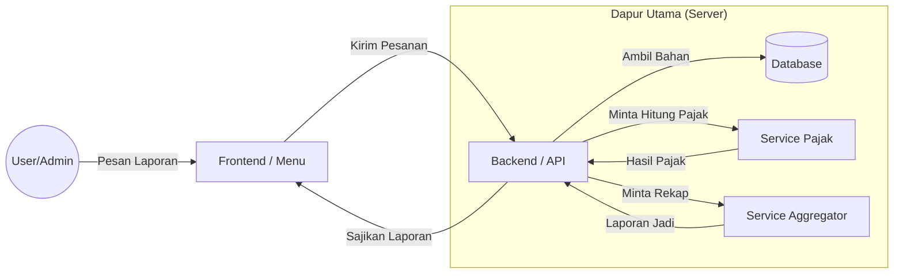
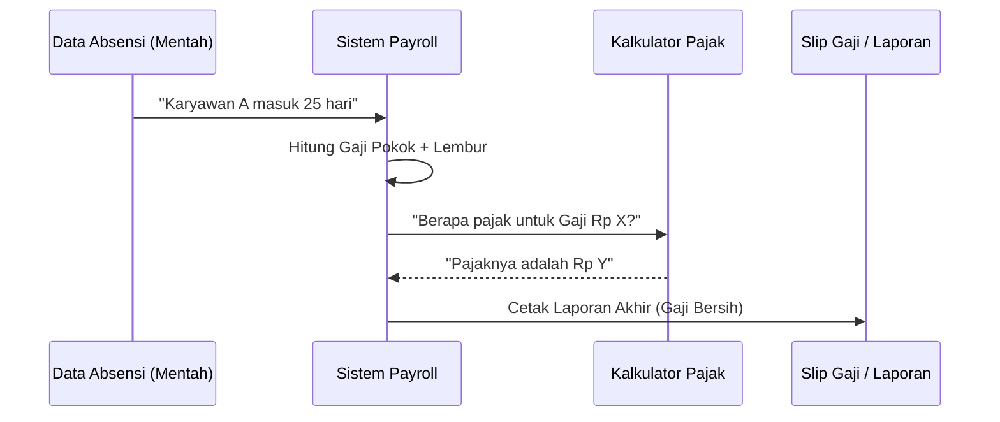

# Panduan Struktur Sistem Payroll (Untuk Orang Awam)

Dokumen ini menjelaskan bagaimana sistem ini bekerja tanpa menggunakan bahasa teknis yang rumit.

---

## 1. Analogi Sistem: "Restoran Payroll"
Bayangkan sistem ini adalah sebuah restoran besar yang menyajikan "Laporan Gaji".

*   **Frontend (Kasir/Menu):** Apa yang Anda lihat di layar. Tempat Anda klik tombol dan melihat tabel.
*   **Backend (Pelayan):** Otak yang mengatur segalanya. Dia tidak memasak, tapi dia tahu siapa yang harus dihubungi.
*   **Database (Gudang):** Tempat semua data mentah disimpan (nama karyawan, jam kerja, dll).
*   **Service Pajak (Akuntan):** Spesialis yang hanya tahu cara menghitung PPh21.
*   **Service Aggregator (Tukang Masak):** Yang meramu data mentah menjadi laporan yang enak dibaca.

---

## 2. Alur "Perjalanan Data"
Bagaimana data mentah dari lapangan berubah menjadi angka di rekening.

---

## 3. Peta Departemen (Folder)
Jika project ini adalah sebuah kantor pusat, berikut adalah pembagian ruangannya:

| Nama Folder | Nama Departemen | Tugas Utama |
|:---|:---|:---|
| `frontend/` | **Lobby & Resepsionis** | Tempat user berinteraksi dan melihat tampilan. |
| `backend/` | **Kantor Pusat / Manajemen** | Mengelola alur data dan keamanan. |
| `Additional_services/` | **Divisi Spesialis** | Tim ahli khusus: Tukang hitung pajak, tukang rekap data. |
| `dokumentasi/` | **Perpustakaan & SOP** | Kumpulan manual dan cara kerja sistem. |
| `_dev_utils/` | **Gudang Alat & Workshop** | Tempat obeng, palu, dan skrip bantuan para teknisi (developer). |
| `context_portal/` | **Arsip Digital AI** | Memori khusus agar asisten AI paham sejarah kode ini. |

---

## 4. Kenapa Dibagi-bagi Banyak Folder?
Sama seperti perusahaan, kita tidak ingin kasir juga harus menghitung pajak dan juga harus mengambil barang di gudang sendirian. 
- **Terpisah = Rapi:** Jika kalkulator pajak rusak, bagian tampilan (frontend) masih bisa menyala.
- **Mudah Diganti:** Jika aturan pajak pemerintah berubah, kita hanya perlu memperbaiki folder `hitung_pajak` tanpa mengganggu folder lainnya.
