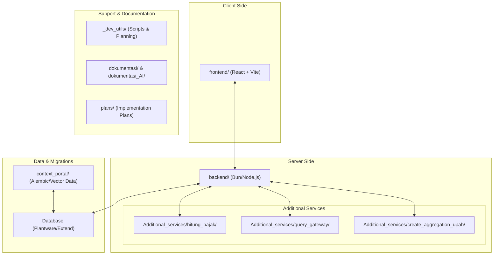

# Struktur Bagan Project (Codebase Architecture)

Dokumen ini menjelaskan struktur tingkat tinggi dari project **Payroll Daftar Upah** melalui diagram bagan untuk memudahkan pemahaman alur dan organisasi file.

## Diagram Arsitektur Global

## Deskripsi Folder Utama

### 1. Frontend (`frontend/`)
Berisi kode sumber untuk antarmuka pengguna (UI).
- **Tech Stack:** React, Vite, Bun.
- **Fungsi:** Dashboard input data, preview laporan upah, dan visualisasi data pajak.

### 2. Backend (`backend/`)
Inti dari logika bisnis dan API utama.
- **Tech Stack:** Bun/Node.js, TypeScript.
- **Fungsi:** Autentikasi, pengolahan data karyawan, perhitungan upah, dan integrasi dengan database.

### 3. Additional Services (`Additional_services/`)
Kumpulan layanan mikro atau utility service terpisah untuk tugas spesifik.
- **hitung_pajak:** Modul khusus perhitungan PPh21.
- **query_gateway:** Gerbang untuk pengambilan data kompleks.
- **create_aggregation_upah:** Layanan untuk mengumpulkan data upah dari berbagai sumber.

### 4. Database & Context Portal (`context_portal/`)
- **context_portal:** Menggunakan Alembic (Python) untuk migrasi database dan penyimpanan data vektor untuk context AI.

### 5. Development Utilities (`_dev_utils/`)
Sesuai dengan `GEMINI.md`, folder ini memisahkan file pendukung dari kode aplikasi utama.
- **scripts:** Script satu kali jalan untuk pengecekan data.
- **planning:** Dokumen teknis rencana fitur baru.
- **prompts:** Instruksi khusus untuk AI agent.

### 6. Dokumentasi (`dokumentasi/` & `dokumentasi_AI/`)
- **dokumentasi:** Dokumentasi teknis sistem (API, Database, Struktur).
- **dokumentasi_AI:** Panduan dan aturan khusus untuk AI dalam mengelola codebase ini.
