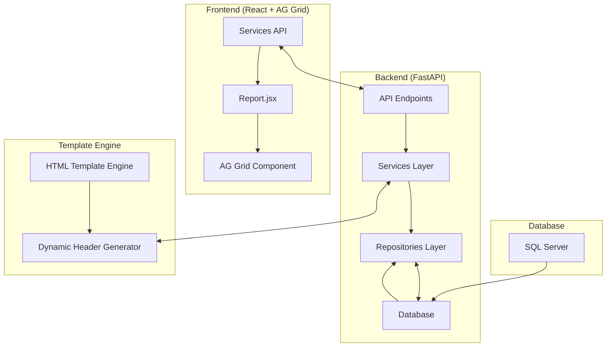

# Arsitektur Sistem Report Plantware Daftar Upah

## Diagram Alur Data (Data Flow Diagram)

## Penjelasan Alur:
1. **Frontend** (Report.jsx) memanggil layanan API untuk mengambil data
2. **API Endpoints** menerima permintaan dan meneruskannya ke Services Layer
3. **Services Layer** memproses logika bisnis dan memanggil Repositories Layer
4. **Repositories Layer** melakukan operasi CRUD ke database
5. **Database** menyediakan data ke sistem
6. **Dynamic Header Generator** membuat header secara dinamis berdasarkan data sebenarnya
7. **AG Grid** merender data dalam bentuk tabel dengan fitur-fitur canggih

## Komponen Utama:
- **Frontend**: React, AG Grid React, Axios untuk API calls
- **Backend**: FastAPI, Pydantic, Database abstraction
- **Database**: SQL Server (koneksi melalui MSSQL Service)
- **Template Engine**: HTML templating untuk laporan

## Arsitektur Rendering AG Grid:
1. Frontend meminta data dan definisi kolom
2. Backend menghasilkan definisi kolom dinamis berdasarkan data
3. Frontend menerima data dan konfigurasi kolom
4. AG Grid merender tabel dengan fitur yang sesuai
5. Kolom NO dan NAMA difreeze di posisi kiri