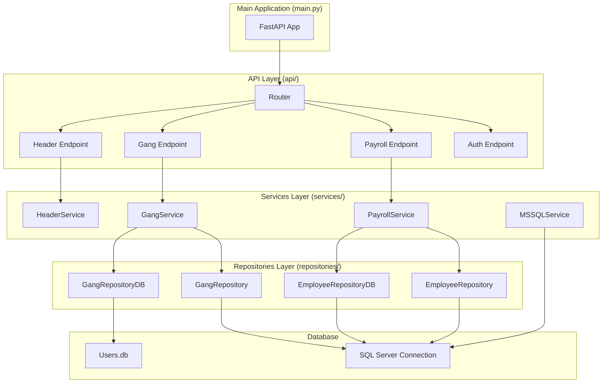
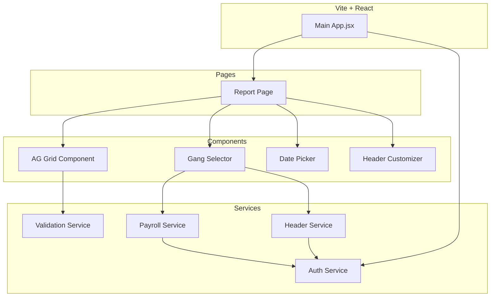

# Diagram Arsitektur Komponen

## Struktur Backend

## Struktur Frontend

## Penjelasan:
### Backend:
- **Main Application**: Titik masuk aplikasi FastAPI
- **API Layer**: Endpoint-endpoint HTTP untuk berbagai fungsi sistem
- **Services Layer**: Logika bisnis dan pemrosesan data
- **Repositories Layer**: Abstraksi akses database
- **Database**: Sumber data utama sistem

### Frontend:
- **Main App**: Komponen utama React
- **Pages**: Halaman-halaman aplikasi
- **Components**: Komponen UI reusable
- **Services**: Layanan untuk komunikasi dengan backend