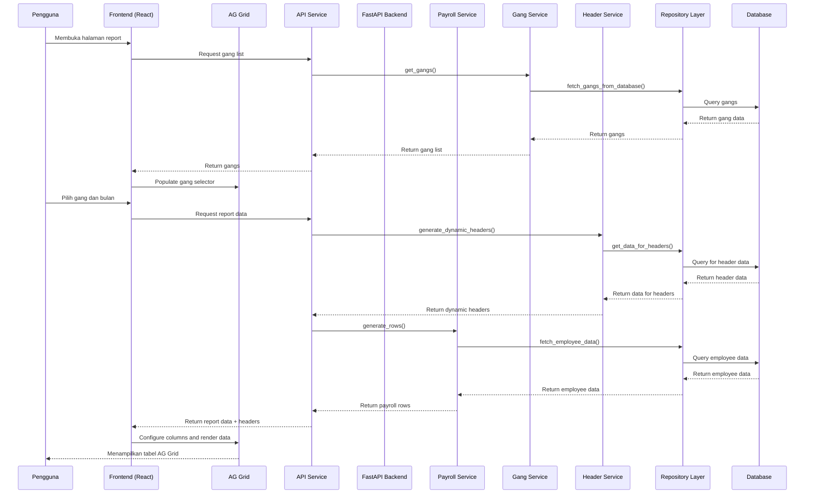

# Diagram Interaksi Sistem - Sequence Diagram

## Alur Pengambilan dan Rendering Data

## Penjelasan:
1. **Inisialisasi**: Pengguna membuka halaman, sistem mendapatkan daftar gang dari database
2. **Pemilihan Parameter**: Pengguna memilih gang dan bulan untuk laporan
3. **Pengambilan Header Dinamis**: Sistem menghasilkan header kolom secara dinamis berdasarkan data aktual
4. **Pengambilan Data Gaji**: Sistem mengambil data karyawan dan perhitungan gaji dari database
5. **Rendering AG Grid**: Frontend mengkonfigurasi dan merender AG Grid dengan data yang diperoleh
6. **Tampilan Akhir**: Tabel AG Grid ditampilkan dengan kolom-kolom yang sesuai dan fitur-fitur lanjutan