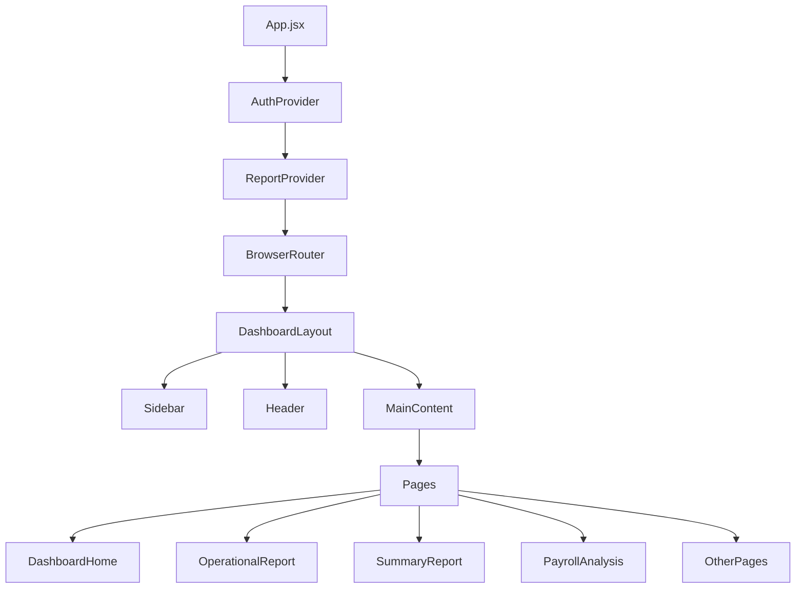
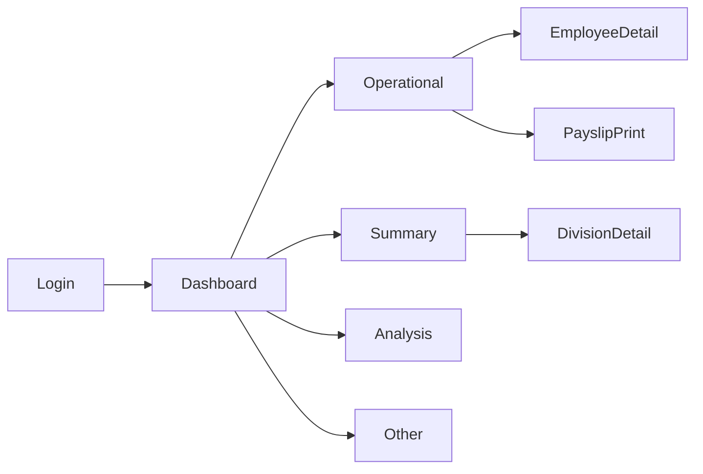

# Struktur UI (User Interface)

## Overview

Frontend menggunakan React dengan komponen berbasis AG Grid Enterprise untuk menampilkan data payroll. UI mengikuti pola **Dashboard Layout** dengan sidebar navigation dan content area.

---

## Layout Architecture



---

## Page Hierarchy

### Main Pages

| Page | Route | Component | Description |
|------|-------|-----------|-------------|
| Dashboard Home | `/` | `DashboardHome.jsx` | Landing page dengan KPI cards |
| Operational Report | `/operational` | `CustomPayrollTable.jsx` | Main payroll grid |
| Summary Report | `/summary` | `SummaryReportPage.jsx` | Division summary |
| Wages Summary Rebinmas | `/wages-rebinmas` | `WagesSummaryRebinmasPage.jsx` | Rebinmas wages |
| Wages Summary IJL | `/wages-ijl` | `WagesSummaryIJLPage.jsx` | IJL wages |
| Analysis Report | `/analysis` | `AnalysisReportPage.jsx` | Analysis report |
| Payroll Analysis | `/comprehensive` | `PayrollAnalysisPage.jsx` | Comprehensive analysis |
| Executive Payroll | `/executive` | `ExecutivePayrollPage.jsx` | Executive view |
| Aggregation Seeder | `/seed` | `AggregationSeederPage.jsx` | Admin aggregation |
| Spreadsheet Sync | `/spreadsheet-sync` | `SpreadsheetSyncPage.jsx` | Google sync |
| Employee Detail | `/employee/detail` | `EmployeeDetailRoute.jsx` | Employee details |
| Payslip Print | `/payslip-print` | `PayslipPrintPage.jsx` | Print payslips |
| Gang Comparison | `/gang-comparison-report` | `GangComparisonReportPage.jsx` | Gang comparison |
| Login | `/login` | `LoginPage.jsx` | Authentication |

---

## Component Structure

### 1. Layout Components

#### DashboardLayout.jsx
Main layout wrapper dengan sidebar navigation.

```
|-- DashboardLayout
    |-- Sidebar
    |   |-- Logo
    |   |-- Navigation Menu
    |   |-- User Info
    |-- Header
    |   |-- Page Title
    |   |-- Period Selector
    |   |-- Division Filter
    |-- Main Content
        |-- Outlet (React Router)
```

### 2. Common Components

#### AgGridWrapper.jsx
Wrapper untuk AG Grid dengan tema dan konfigurasi default.

```jsx
<AgGridWrapper
    theme="ag-theme-alpine"
    height="100%"
    width="100%"
>
    {/* AG Grid content */}
</AgGridWrapper>
```

#### GangFilter.jsx
Dropdown filter untuk memilih gang.

```jsx
<GangFilter
    division={division}
    value={gang}
    onChange={setGang}
    gangs={gangs}
    loading={gangLoading}
/>
```

#### MonthPicker.jsx / MonthSelector.jsx
Komponen untuk memilih bulan dan tahun.

```jsx
<MonthPicker
    month={month}
    year={year}
    onChange={(m, y) => { setMonth(m); setYear(y); }}
/>
```

#### LoadingScreen.jsx
Loading overlay dengan animasi.

```jsx
<LoadingScreen
    isLoading={true}
    message="Memuat data..."
/>
```

#### Modal.jsx
Reusable modal dialog.

```jsx
<Modal
    isOpen={isOpen}
    onClose={onClose}
    title="Modal Title"
>
    {/* Modal content */}
</Modal>
```

#### SummaryKPICards.jsx
KPI cards untuk summary page.

```jsx
<SummaryKPICards
    data={{
        total_karyawan: 100,
        total_hk: 2500,
        total_upah: 500000000
    }}
/>
```

### 3. Dashboard Components

#### KPICard.jsx
Individual KPI card.

```jsx
<KPICard
    title="Total Karyawan"
    value={150}
    icon={<UsersIcon />}
    trend="+5%"
    color="blue"
/>
```

#### GangComparisonChart.jsx
Chart untuk perbandingan antar gang.

```jsx
<GangComparisonChart
    data={gangData}
    metric="upah_bersih"
    period={{ month: 12, year: 2025 }}
/>
```

#### GangCostBreakdownChart.jsx
Breakdown chart untuk biaya per gang.

```jsx
<GangCostBreakdownChart
    gangCode="H1H"
    data={costBreakdown}
/>
```

#### PremiCompositionChart.jsx
Pie/bar chart untuk komposisi premi.

```jsx
<PremiCompositionChart
    data={premiData}
    type="pie"
/>
```

### 4. Employee Components

#### EmployeeDetailPage.jsx
Detail page untuk individual employee.

```
|-- EmployeeDetailPage
    |-- Header
    |   |-- Employee Info (NIK, Nama, Gang)
    |   |-- Period Selector
    |-- KPI Cards
    |   |-- HK Summary
    |   |-- Gaji Pokok
    |   |-- Total Upah
    |-- Tabs
    |   |-- Overview Tab
    |   |-- Lembur Tab (Calendar View)
    |   |-- Premi Tab
    |   |-- Potongan Tab
    |-- Detail Tables
```

### 5. Payroll Table Components

#### CustomPayrollTable.jsx
Custom table untuk menampilkan data payroll.

```
|-- CustomPayrollTable
    |-- Toolbar
    |   |-- Filter Controls
    |   |-- Export Buttons
    |   |-- Font Size Controls
    |-- AG Grid
    |   |-- Column Groups
    |   |   |-- Informasi Karyawan
    |   |   |-- Absensi
    |   |   |-- Gaji Pokok
    |   |   |-- Tunjangan
    |   |   |-- Lembur
    |   |   |-- Premi
    |   |   |-- Potongan
    |   |   |-- Total
    |   |-- Row Data
    |   |-- Gang Headers
    |   |-- Gang Totals
    |   |-- Grand Total
    |-- Status Bar
        |-- Selection Count
        |-- Sum of selected rows
```

### 6. Report Components

#### SummaryWagesReport.jsx
Report untuk summary wages.

```
|-- SummaryWagesReport
    |-- Filter Bar
    |-- Summary Cards
    |-- Division Breakdown
    |-- Charts
    |-- Export Actions
```

#### CostHKComparisonReport.jsx
Report perbandingan cost per HK.

```
|-- CostHKComparisonReport
    |-- Filter Controls
    |-- Comparison Table
    |-- Trend Charts
    |-- Analysis Summary
```

---

## UI Styling

### CSS Files Structure

| File | Purpose |
|------|---------|
| `theme.css` | Global theme variables |
| `dashboard-modern.css` | Dashboard styling |
| `ag-grid-professional.css` | AG Grid custom theme |
| `report.css` | Report page styling |
| `summary-report.css` | Summary report styling |
| `wages-summary-professional.css` | Wages summary styling |
| `print-optimization.css` | Print media queries |
| `payslip-print.css` | Payslip print styling |

### Theme Variables

```css
:root {
    /* Colors */
    --primary-color: #3b82f6;
    --secondary-color: #64748b;
    --success-color: #10b981;
    --warning-color: #f59e0b;
    --danger-color: #ef4444;
    
    /* Backgrounds */
    --bg-primary: #ffffff;
    --bg-secondary: #f1f5f9;
    --bg-tertiary: #e2e8f0;
    
    /* Text */
    --text-primary: #0f172a;
    --text-secondary: #475569;
    --text-muted: #94a3b8;
    
    /* Borders */
    --border-color: #e2e8f0;
    --border-radius: 8px;
    
    /* Shadows */
    --shadow-sm: 0 1px 2px rgba(0,0,0,0.05);
    --shadow-md: 0 4px 6px rgba(0,0,0,0.1);
    --shadow-lg: 0 10px 15px rgba(0,0,0,0.1);
}
```

---

## AG Grid Configuration

### Column Groups Structure

```javascript
const columnDefs = [
    {
        headerName: 'INFORMASI KARYAWAN',
        children: [
            { field: 'nik', headerName: 'NIK' },
            { field: 'nama', headerName: 'NAMA' },
            { field: 'jabatan_estate', headerName: 'JABATAN' },
            { field: 'gang_code', headerName: 'GANG' },
        ]
    },
    {
        headerName: 'ABSENSI',
        children: [
            { field: 'jumlah_hk', headerName: 'HK' },
            { field: 'hari_kerja', headerName: 'HARI KERJA' },
            // ... more columns
        ]
    },
    // ... more groups
];
```

### Grid Features

| Feature | Implementation |
|---------|---------------|
| Sorting | Built-in AG Grid |
| Filtering | Built-in AG Grid |
| Grouping | Gang-based grouping |
| Pinned Columns | NIK, Nama pinned left |
| Row Selection | Checkbox selection |
| Range Selection | For copy/paste |
| Excel Export | AG Grid Enterprise |
| CSV Export | AG Grid Community |
| Pagination | Client-side pagination |
| Virtual Scroll | For large datasets |

---

## Responsive Design

### Breakpoints

| Breakpoint | Width | Layout |
|------------|-------|--------|
| Mobile | < 640px | Single column, stacked |
| Tablet | 640px - 1024px | Two columns |
| Desktop | > 1024px | Full layout |

### Mobile Adaptations

1. **Sidebar**: Collapsible drawer
2. **Tables**: Horizontal scroll
3. **Charts**: Stacked layout
4. **Filters**: Accordion collapse

---

## User Interactions

### Navigation Flow



### Key User Actions

| Action | Component | Handler |
|--------|-----------|---------|
| Select Division | `DivisionTabs` | `setDivision()` |
| Select Gang | `GangFilter` | `setGang()` |
| Select Period | `MonthPicker` | `setMonth/setYear()` |
| Export Excel | `ReportToolbar` | `handleExportExcel()` |
| Print | `ReportToolbar` | `window.print()` |
| View Employee | `CustomPayrollTable` | `handleViewEmployeeDetail()` |
| Select Rows | `AgGridWrapper` | `onSelectionChanged()` |

---

## Print Layout

### Print Optimization

```css
@media print {
    /* Hide non-essential elements */
    .no-print {
        display: none !important;
    }
    
    /* Optimize table for print */
    .ag-grid {
        font-size: 10pt;
    }
    
    /* Page breaks */
    .page-break {
        page-break-before: always;
    }
    
    /* Repeat headers */
    thead {
        display: table-header-group;
    }
}
```

### Print Modes

| Mode | Description |
|------|-------------|
| Full Report | All columns, all rows |
| Summary Only | Aggregated data |
| Selected Rows | Only selected employees |
| Payslip | Individual slip format |

---

## Error States

### Loading States

```jsx
// Loading
<LoadingScreen isLoading={true} message="Memuat data..." />

// Error
<div className="error-state">
    <AlertCircle />
    <p>Gagal memuat data: {error.message}</p>
    <button onClick={retry}>Coba Lagi</button>
</div>

// Empty
<div className="empty-state">
    <Inbox />
    <p>Tidak ada data untuk ditampilkan</p>
</div>
```

---

## Accessibility

### ARIA Labels

```jsx
<button
    aria-label="Export ke Excel"
    aria-busy={exporting}
>
    Export Excel
</button>

<table
    role="grid"
    aria-label="Data Payroll"
>
    {/* table content */}
</table>
```

### Keyboard Navigation

| Key | Action |
|-----|--------|
| Tab | Focus next element |
| Enter | Activate button/link |
| Escape | Close modal |
| Arrow Keys | Navigate grid cells |

---

## Performance Optimizations

### Lazy Loading

```jsx
// Pages are lazy loaded
const DashboardHome = lazy(() => import('./pages/DashboardHome'))
const SummaryReportPage = lazy(() => import('./pages/SummaryReportPage'))
```

### Memoization

```jsx
// Expensive computations are memoized
const filteredData = useMemo(() => {
    return data.filter(/* ... */)
}, [data, filters])

// Callbacks are memoized
const handleExport = useCallback(() => {
    exportToExcel(data)
}, [data])
```

### Virtual Scrolling

AG Grid menggunakan virtual scrolling untuk menampilkan ribuan baris tanpa performance penalty.

---

*Dokumentasi ini dibuat secara otomatis berdasarkan analisis komponen React*