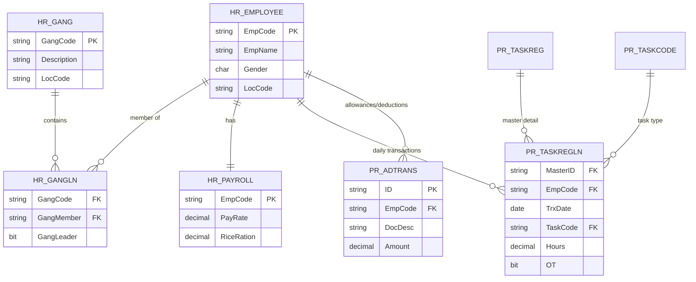

# Database Schema Documentation

## Overview

Sistem menggunakan **Microsoft SQL Server (MSSQL)** dengan tiga database utama yang diakses melalui **SQL Gateway Pattern**:

| Database | Profile | Usage |
|----------|---------|-------|
| `db_ptrj` | SERVER_PROFILE_2 | Main payroll data (production) |
| `extend_db_ptrj` | SERVER_PROFILE_1 | Aggregation history, analysis reports |
| `VenusHR14` | SERVER_PROFILE_3 | Employee master, FFB weight |
| `db_ptrj_mill` | SERVER_PROFILE_3 | Mill data (WM_TICKET) |

---

## Connection Pattern

```
Backend (Bun) -> SQL Gateway API (Python) -> MSSQL
```

Backend tidak terhubung langsung ke database. Semua query melalui endpoint:
```
POST {DB_API_URL}/v1/query
Body: { sql, params, server, database }
```

---

## Core Tables

### HR_EMPLOYEE (VenusHR14)

Master data karyawan.

| Column | Type | Description |
|--------|------|-------------|
| EmpCode | VARCHAR(20) | Kode karyawan (NIK) - Primary Key |
| EmpName | VARCHAR(100) | Nama lengkap |
| Gender | CHAR(1) | Jenis kelamin (L/P) |
| MaritalStatus | VARCHAR(20) | Status pernikahan |
| DOB | DATE | Tanggal lahir |
| Race | VARCHAR(50) | Suku |
| Religion | VARCHAR(50) | Agama |
| Status | CHAR(1) | Status aktif (A) |
| LocCode | VARCHAR(20) | Kode lokasi/divisi |
| PayrollInd | CHAR(1) | Indikator payroll |
| CreateDate | DATETIME | Tanggal pembuatan record |
| UpdateDate | DATETIME | Tanggal update terakhir |
| HREmpType | VARCHAR(20) | Tipe karyawan |
| IsCasual | BIT | Status karyawan casual |

**Query Example:**
```sql
SELECT EmpCode, EmpName, Gender, LocCode
FROM HR_EMPLOYEE
WHERE Status = 'A'
```

---

### HR_GANGLN (VenusHR14)

Relasi karyawan dengan gang (kelompok kerja).

| Column | Type | Description |
|--------|------|-------------|
| GangCode | VARCHAR(20) | Kode gang - Foreign Key to HR_GANG |
| GangMember | VARCHAR(20) | Kode karyawan - Foreign Key to HR_EMPLOYEE |
| GangLeader | BIT | Apakah leader gang |
| JoinDate | DATE | Tanggal bergabung |
| Status | CHAR(1) | Status aktif |

**Query Example:**
```sql
SELECT g.GangCode, g.GangMember, e.EmpName
FROM HR_GANGLN g
INNER JOIN HR_EMPLOYEE e ON e.EmpCode = g.GangMember
WHERE g.GangCode LIKE 'H%'
```

---

### HR_GANG (VenusHR14)

Master data gang.

| Column | Type | Description |
|--------|------|-------------|
| GangCode | VARCHAR(20) | Kode gang - Primary Key |
| Description | VARCHAR(100) | Deskripsi gang |
| LocCode | VARCHAR(20) | Kode lokasi |
| GangType | VARCHAR(20) | Tipe gang (Harvester, Infrastructure, dll) |
| Status | CHAR(1) | Status aktif |

---

### HR_PAYROLL (VenusHR14 / db_ptrj)

Data payroll karyawan.

| Column | Type | Description |
|--------|------|-------------|
| EmpCode | VARCHAR(20) | Kode karyawan - Primary Key |
| PayRate | DECIMAL(18,2) | Rate gaji per hari |
| RiceRation | DECIMAL(18,2) | Tunjangan beras (beras_rate) |
| Position | VARCHAR(50) | Jabatan |
| BankCode | VARCHAR(20) | Kode bank |
| BankAcctNo | VARCHAR(30) | Nomor rekening |
| JoinDate | DATE | Tanggal masuk kerja |
| ResignDate | DATE | Tanggal resign |

**Note:** `RiceRation` digunakan untuk menentukan status PTKP:
- 2250 = TK/0
- 3250 = TK/1
- 4200 = TK/2
- 3750 = K/0
- 4650 = K/1
- 5550 = K/2
- 6450 = K/3

---

### PR_TASKREGLN (db_ptrj)

Detail transaksi harian karyawan.

| Column | Type | Description |
|--------|------|-------------|
| MasterID | VARCHAR(50) | ID master transaksi |
| LineNo | INT | Nomor baris |
| EmpCode | VARCHAR(20) | Kode karyawan |
| TrxDate | DATE | Tanggal transaksi |
| TaskCode | VARCHAR(20) | Kode tugas |
| Hours | DECIMAL(18,2) | Jam kerja |
| OT | BIT | Flag overtime (1 = lembur) |
| Amount | DECIMAL(18,2) | Jumlah upah |
| Rate | DECIMAL(18,2) | Rate upah |

**Archive Tables:**
- `PR_TASKREGLN_ARC` - Data arsip transaksi
- `PR_TASKREG_ARC` - Data arsip master

**Query for Overtime:**
```sql
SELECT l.EmpCode, l.TrxDate, l.Hours, l.TaskCode, l.Amount
FROM PR_TASKREGLN l
JOIN PR_TASKREG m ON l.MasterID = m.ID
WHERE l.EmpCode = ? 
  AND l.TrxDate >= ? 
  AND l.TrxDate <= ? 
  AND l.OT = 1
```

---

### PR_TASKREG (db_ptrj)

Master transaksi harian.

| Column | Type | Description |
|--------|------|-------------|
| ID | VARCHAR(50) | ID transaksi - Primary Key |
| TrxDate | DATE | Tanggal transaksi |
| LocCode | VARCHAR(20) | Kode lokasi |
| PeriodMonth | INT | Bulan periode |
| PeriodYear | INT | Tahun periode |
| Status | CHAR(1) | Status transaksi |

---

### PR_TASKCODE (db_ptrj)

Master kode tugas/pekerjaan.

| Column | Type | Description |
|--------|------|-------------|
| TaskCode | VARCHAR(20) | Kode tugas - Primary Key |
| TaskDesc | VARCHAR(100) | Deskripsi tugas |
| TaskType | VARCHAR(20) | Tipe tugas |
| UOM | VARCHAR(20) | Unit of measure |
| Rate | DECIMAL(18,2) | Rate standar |

---

### PR_ADTRANS (db_ptrj)

Transaksi tambahan/potongan (allowances/deductions).

| Column | Type | Description |
|--------|------|-------------|
| ID | VARCHAR(50) | ID transaksi - Primary Key |
| EmpCode | VARCHAR(20) | Kode karyawan |
| DocDesc | VARCHAR(100) | Deskripsi dokumen |
| Amount | DECIMAL(18,2) | Jumlah |
| TrxMonth | INT | Bulan transaksi |
| TrxYear | INT | Tahun transaksi |
| LocCode | VARCHAR(20) | Kode lokasi |

**DocDesc Patterns:**
| Pattern | Category |
|---------|----------|
| PREMI%, BRONDOL% | Premi |
| POT%, POTONGAN% | Potongan |
| PPH%, PPH21% | Pajak |
| LEMBUR% | Lembur |
| TUNJANGAN% | Tunjangan |
| SPSI% | Simpanan Pinjaman |
| KOREKSI% | Koreksi |

**Query for Premi:**
```sql
SELECT EmpCode, DocDesc, Amount
FROM PR_ADTRANS
WHERE EmpCode = ?
  AND TrxMonth = ?
  AND TrxYear = ?
  AND DocDesc LIKE '%PREMI%'
```

---

## Aggregation Tables (extend_db_ptrj)

### daftar_upah_aggregation_history

Menyimpan history agregasi payroll per periode.

| Column | Type | Description |
|--------|------|-------------|
| id | INT | Primary Key (auto increment) |
| division_code | VARCHAR(20) | Kode divisi |
| gang_code | VARCHAR(20) | Kode gang |
| month | INT | Bulan |
| year | INT | Tahun |
| total_employees | INT | Total karyawan |
| total_hk | DECIMAL(18,2) | Total hari kerja |
| total_gaji_pokok | DECIMAL(18,2) | Total gaji pokok |
| total_tunjangan | DECIMAL(18,2) | Total tunjangan |
| total_premi | DECIMAL(18,2) | Total premi |
| total_lembur | DECIMAL(18,2) | Total lembur |
| total_potongan | DECIMAL(18,2) | Total potongan |
| total_upah_kotor | DECIMAL(18,2) | Total upah kotor |
| total_upah_bersih | DECIMAL(18,2) | Total upah bersih |
| created_at | DATETIME | Tanggal pembuatan |
| updated_at | DATETIME | Tanggal update |

**Query Example:**
```sql
SELECT division_code, SUM(total_upah_bersih) as total
FROM daftar_upah_aggregation_history
WHERE month = ? AND year = ?
GROUP BY division_code
```

---

## Mill Tables (db_ptrj_mill)

### WM_TICKET

Data tiket timbangan TBS (Fresh Fruit Bunches).

| Column | Type | Description |
|--------|------|-------------|
| TicketNo | VARCHAR(50) | Nomor tiket - Primary Key |
| TrxDate | DATE | Tanggal transaksi |
| SupplierCode | VARCHAR(20) | Kode supplier |
| VehicleNo | VARCHAR(20) | Nomor kendaraan |
| GrossWeight | DECIMAL(18,2) | Berat kotor |
| TareWeight | DECIMAL(18,2) | Berat tara |
| NetWeight | DECIMAL(18,2) | Berat bersih |
| FFBWeight | DECIMAL(18,2) | Berat TBS |

**Query for FFB Weight:**
```sql
SELECT SupplierCode, SUM(FFBWeight) as TotalFFB
FROM WM_TICKET
WHERE TrxDate >= ? AND TrxDate <= ?
GROUP BY SupplierCode
```

---

## Database Relationships



---

## Index Recommendations

### HR_EMPLOYEE
```sql
CREATE INDEX IX_HR_EMPLOYEE_LocCode ON HR_EMPLOYEE(LocCode);
CREATE INDEX IX_HR_EMPLOYEE_Status ON HR_EMPLOYEE(Status);
```

### PR_TASKREGLN
```sql
CREATE INDEX IX_PR_TASKREGLN_EmpCode ON PR_TASKREGLN(EmpCode);
CREATE INDEX IX_PR_TASKREGLN_TrxDate ON PR_TASKREGLN(TrxDate);
CREATE INDEX IX_PR_TASKREGLN_OT ON PR_TASKREGLN(OT);
CREATE INDEX IX_PR_TASKREGLN_EmpCode_TrxDate ON PR_TASKREGLN(EmpCode, TrxDate);
```

### PR_ADTRANS
```sql
CREATE INDEX IX_PR_ADTRANS_EmpCode ON PR_ADTRANS(EmpCode);
CREATE INDEX IX_PR_ADTRANS_DocDesc ON PR_ADTRANS(DocDesc);
CREATE INDEX IX_PR_ADTRANS_Period ON PR_ADTRANS(TrxMonth, TrxYear);
```

---

## Query Patterns

### Get Employee with Gang
```sql
SELECT 
    e.EmpCode, 
    e.EmpName, 
    e.LocCode,
    g.GangCode
FROM HR_EMPLOYEE e
INNER JOIN HR_GANGLN g ON g.GangMember = e.EmpCode
WHERE g.GangCode LIKE ?
ORDER BY g.GangCode, e.EmpCode
```

### Get Attendance (HK)
```sql
SELECT 
    EmpCode,
    COUNT(DISTINCT TrxDate) as HK
FROM PR_TASKREGLN
WHERE TrxDate >= ? AND TrxDate <= ?
  AND OT = 0
GROUP BY EmpCode
```

### Get Overtime Hours
```sql
SELECT 
    EmpCode,
    SUM(Hours) as TotalHours,
    SUM(Amount) as TotalAmount
FROM PR_TASKREGLN
WHERE TrxDate >= ? AND TrxDate <= ?
  AND OT = 1
GROUP BY EmpCode
```

### Get Allowances by Type
```sql
SELECT 
    EmpCode,
    DocDesc,
    SUM(Amount) as Total
FROM PR_ADTRANS
WHERE TrxMonth = ? AND TrxYear = ?
  AND DocDesc LIKE '%PREMI%'
GROUP BY EmpCode, DocDesc
```

---

## Data Archiving

### Archive Tables
Data lama dipindahkan ke tabel archive dengan suffix `_ARC`:
- `PR_TASKREGLN_ARC`
- `PR_TASKREG_ARC`

### Archive Query Pattern
```sql
-- Union active and archive data
SELECT * FROM PR_TASKREGLN WHERE ...
UNION ALL
SELECT * FROM PR_TASKREGLN_ARC WHERE ...
```

---

## Environment Configuration

```bash
# Database Profiles
DB_PROFILE=SERVER_PROFILE_2        # Main payroll
DB_DATABASE=db_ptrj
DB_EXTEND_PROFILE=SERVER_PROFILE_1 # Aggregation
DB_EXTEND_DATABASE=extend_db_ptrj
DB_VENUS_PROFILE=SERVER_PROFILE_3  # Employee/Mill
DB_VENUS_DATABASE=VenusHR14
DB_MILL_DATABASE=db_ptrj_mill

# Connection Settings
DB_API_URL=http://localhost:8001
DB_API_KEY=your-api-key
DB_CONN_TIMEOUT=60
DB_QUERY_TIMEOUT=30
DB_QUERY_RETRIES=3
```

---

## Database Migration Files

Located in `Additional_services/create_aggregation_upah/migrations/`:

| File | Description |
|------|-------------|
| `add_premi_insentif_column.sql` | Add premi insentif column |
| `add_premi_kinerja_column.sql` | Add premi kinerja column |
| `add_tbs_weight_column.sql` | Add TBS weight column |

---

*Dokumentasi ini dibuat secara otomatis berdasarkan analisis query dan struktur tabel*