# Architecture Documentation

## System Overview

Sistem Payroll Daftar Upah menggunakan arsitektur **3-tier** dengan pola **SQL Gateway** untuk akses database.

---

## High-Level Architecture

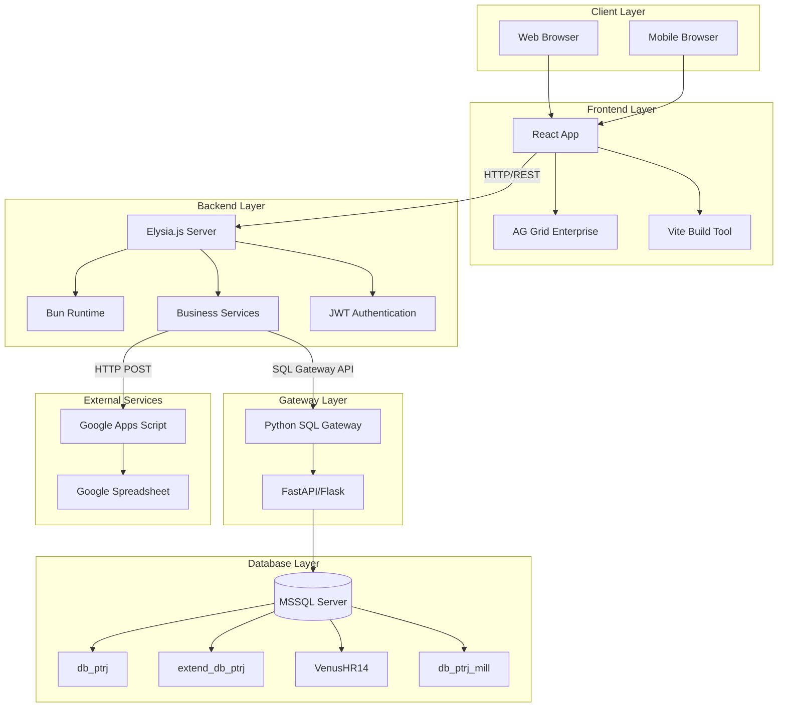

---

## Component Architecture

### Frontend Architecture

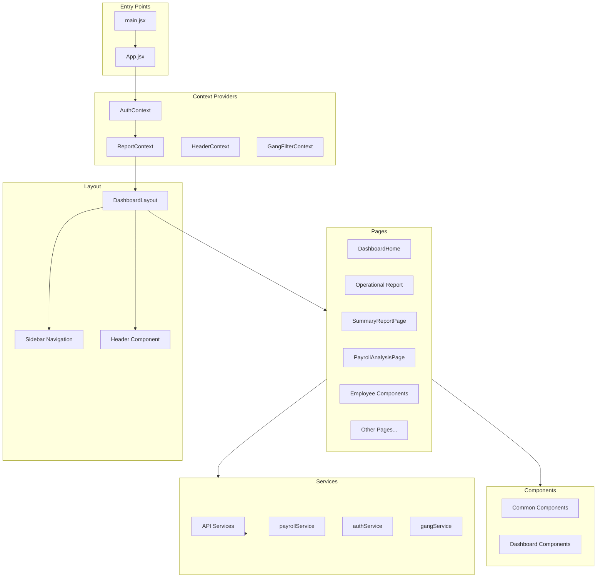

### Backend Architecture

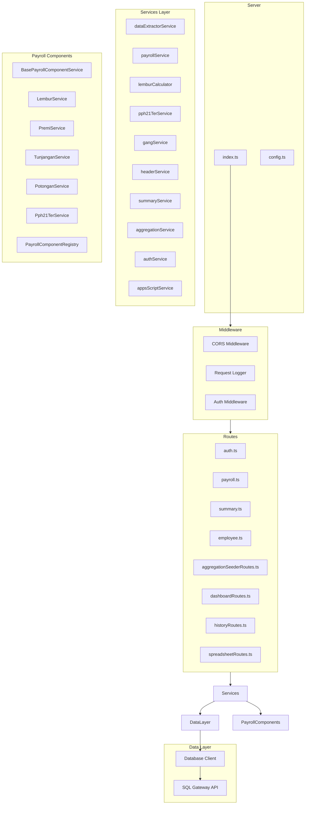

---

## Data Flow Diagrams

### 1. Payroll Report Data Flow

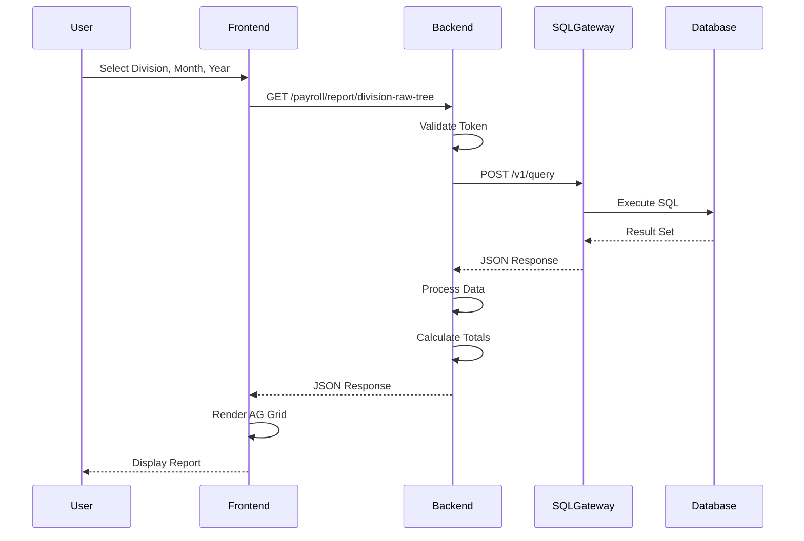

### 2. Overtime Calculation Flow

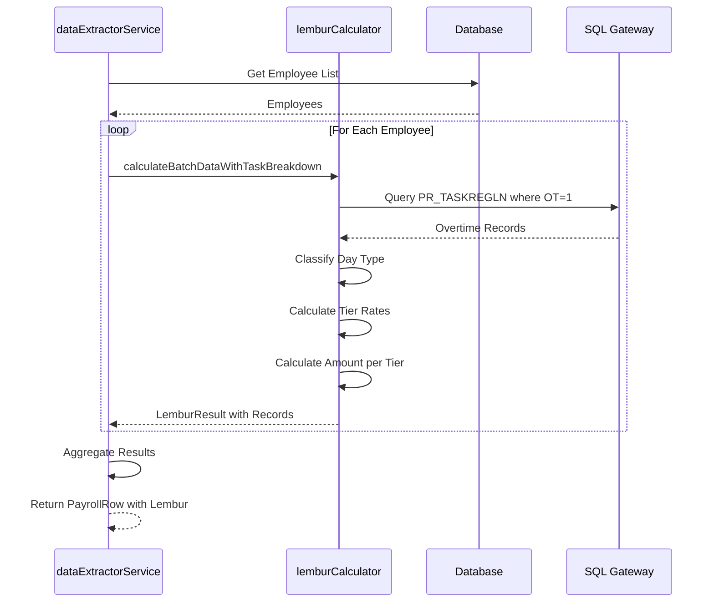

### 3. Authentication Flow

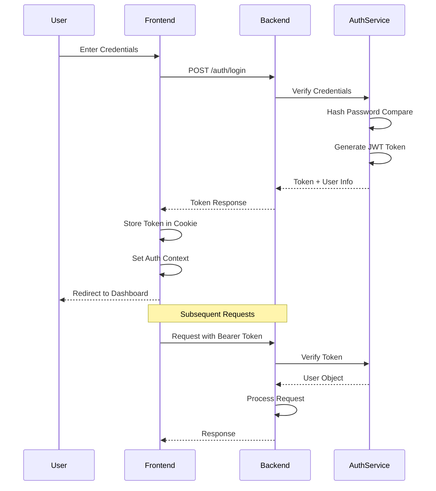

### 4. Google Spreadsheet Sync Flow

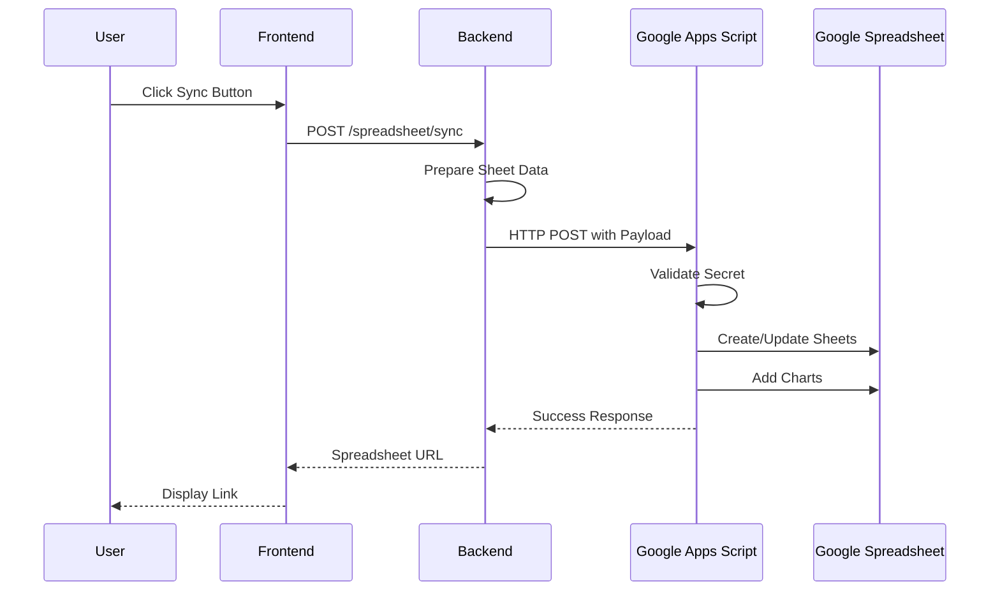

---

## Deployment Architecture

### Development Environment

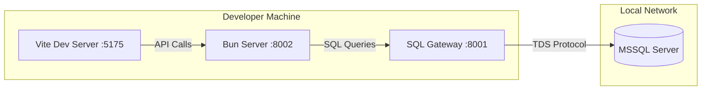

### Production Environment

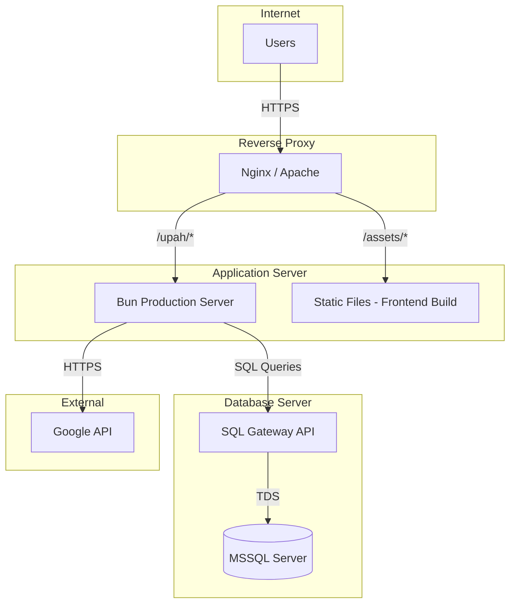

---

## Service Layer Design

### Singleton Pattern

All services implement the Singleton pattern for efficient resource management:

```typescript
export class PayrollService {
    private static instance: PayrollService;
    
    private constructor() {
        // Private constructor
    }
    
    public static getInstance(): PayrollService {
        if (!PayrollService.instance) {
            PayrollService.instance = new PayrollService();
        }
        return PayrollService.instance;
    }
}

export const payrollService = PayrollService.getInstance();
```

### Service Dependencies

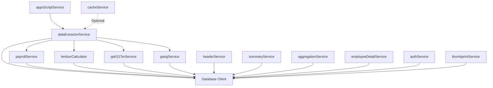

---

## Security Architecture

### Authentication & Authorization

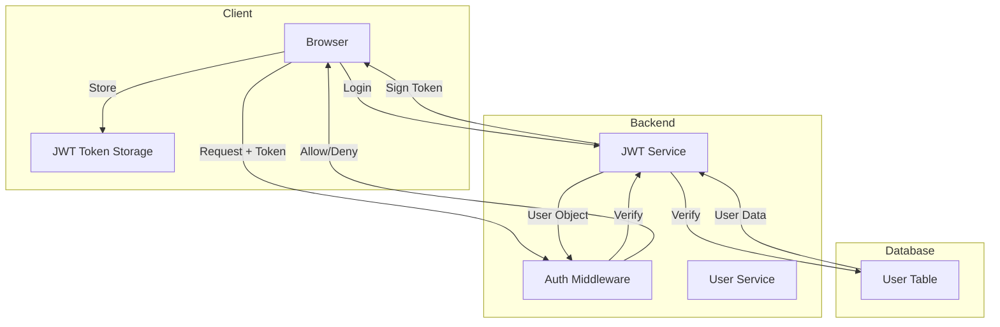

### Role-Based Access Control

| Role | Permissions |
|------|-------------|
| ADMIN | All divisions, all features |
| USER | Assigned divisions only |
| VIEWER | Read-only access |

### Division-Based Access

```typescript
// Token contains allowed divisions
interface UserToken {
    id: number;
    username: string;
    role: UserRole;
    divisions: string[]; // ['AB1', 'AB2'] or ['ALL']
}

// Middleware checks division access
if (currentUser.role !== UserRole.ADMIN) {
    if (!currentUser.divisions.includes(division)) {
        return { status: 403, message: 'Division not accessible' };
    }
}
```

---

## Caching Strategy

### Cache Architecture

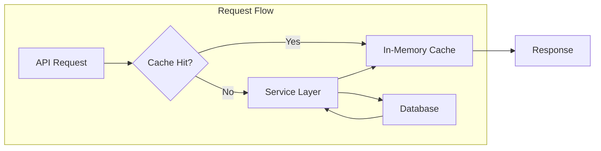

### Cache Configuration

```typescript
// Environment Variables
ENABLE_PRODUCTION_CACHE=true  // Enable in production
DISABLE_CACHE=true            // Force disable
CACHE_TTL_SECONDS=300         // 5 minutes default

// Cache Service
class CacheService {
    private cache: Map<string, { data: any; expiry: number }>;
    
    get<T>(key: string): T | null {
        const item = this.cache.get(key);
        if (item && item.expiry > Date.now()) {
            return item.data;
        }
        return null;
    }
    
    set<T>(key: string, data: T, ttl: number): void {
        this.cache.set(key, {
            data,
            expiry: Date.now() + (ttl * 1000)
        });
    }
}
```

---

## Error Handling Architecture

### Error Flow

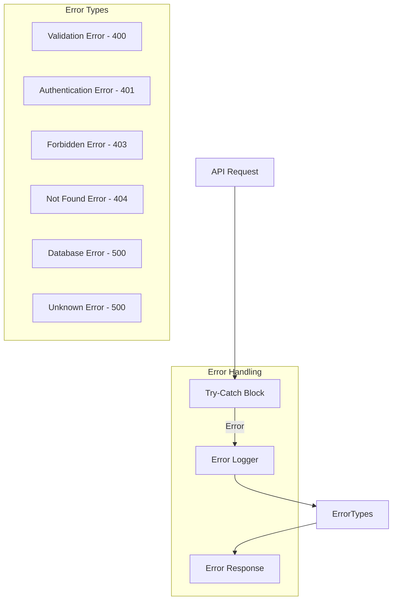

### Error Response Format

```typescript
interface ErrorResponse {
    message: string;
    error?: string;
    stack?: string; // Only in development
}

// Example
{
    "message": "Failed to fetch gangs: Connection timeout",
    "error": "ConnectionError"
}
```

---

## Performance Optimization

### Frontend Optimizations

1. **Lazy Loading**: Pages loaded on demand
2. **Code Splitting**: Separate chunks for each page
3. **Memoization**: useMemo, useCallback for expensive operations
4. **Virtual Scrolling**: AG Grid handles large datasets
5. **Debouncing**: Input handlers debounced

### Backend Optimizations

1. **Singleton Services**: Single instance per service
2. **Connection Pooling**: Via SQL Gateway
3. **Query Optimization**: Indexed queries, prepared statements
4. **Caching**: In-memory cache for frequently accessed data
5. **Batch Processing**: Bulk database operations

### Database Optimizations

1. **Proper Indexing**: On frequently queried columns
2. **Query Tuning**: Optimized JOINs and WHERE clauses
3. **Archive Tables**: Move old data to archive tables
4. **Connection Pooling**: Managed by SQL Gateway

---

## Monitoring & Logging

### Request Logging

```
GET /payroll/divisions 123ms
POST /auth/login 45ms
GET /payroll/report/division-raw-tree?division_code=AB1&month=12&year=2025 234ms
```

### Health Check Endpoint

```json
GET /health
{
    "status": "ok",
    "timestamp": "2025-12-15T10:30:00Z",
    "database": "db_ptrj",
    "profile": "SERVER_PROFILE_2"
}
```

---

## Scalability Considerations

### Horizontal Scaling

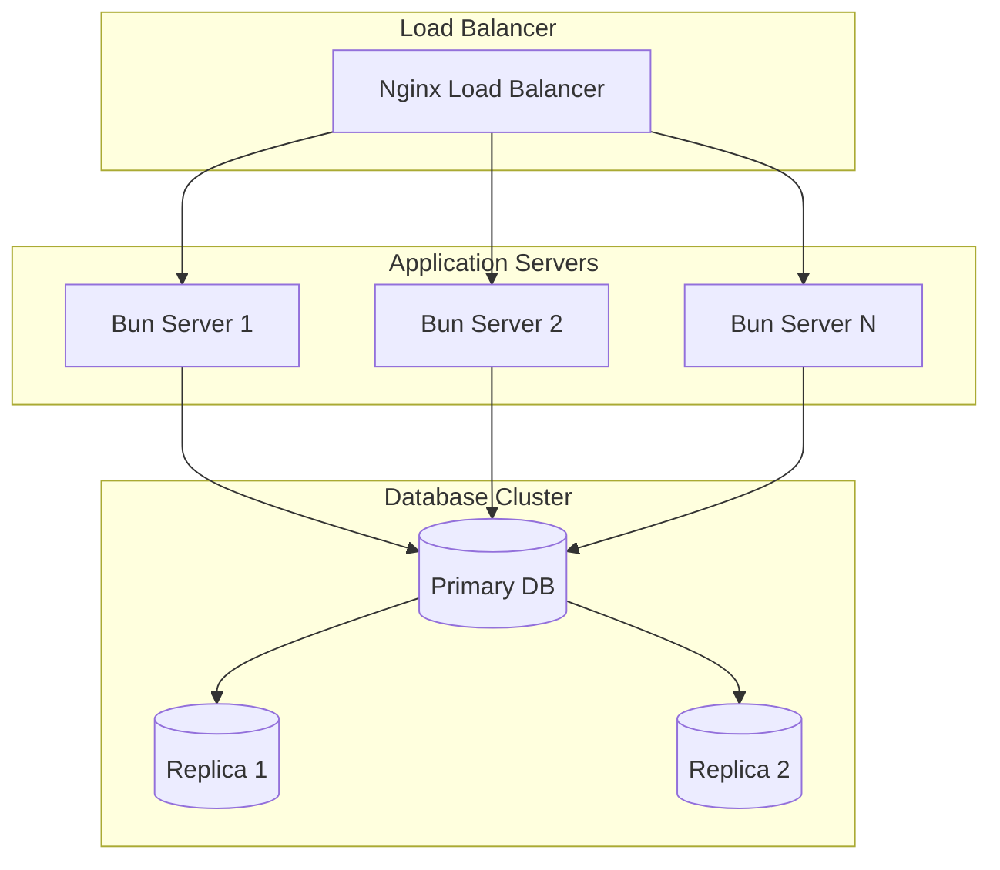

### Future Improvements

1. **Redis Cache**: Distributed caching
2. **Message Queue**: For async operations
3. **Microservices**: Split into smaller services
4. **Containerization**: Docker/Kubernetes deployment
5. **CDN**: For static assets

---

*Dokumentasi ini dibuat secara otomatis berdasarkan analisis arsitektur sistem*