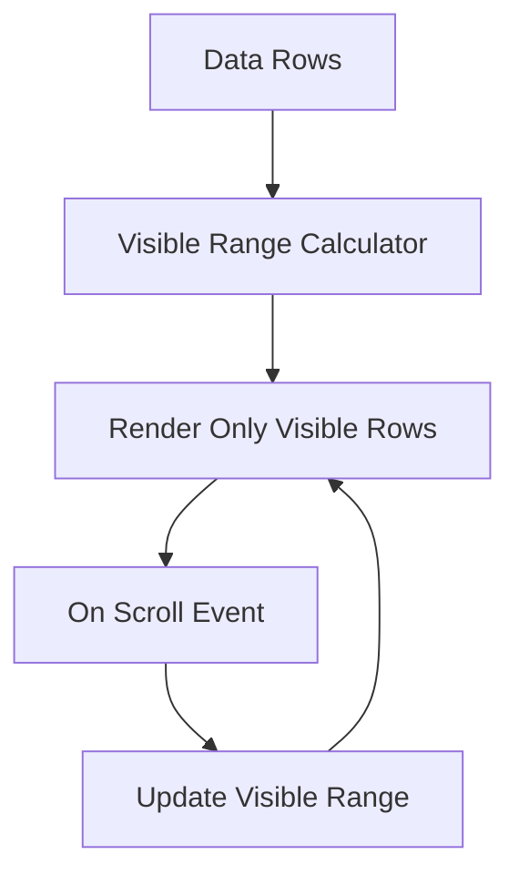
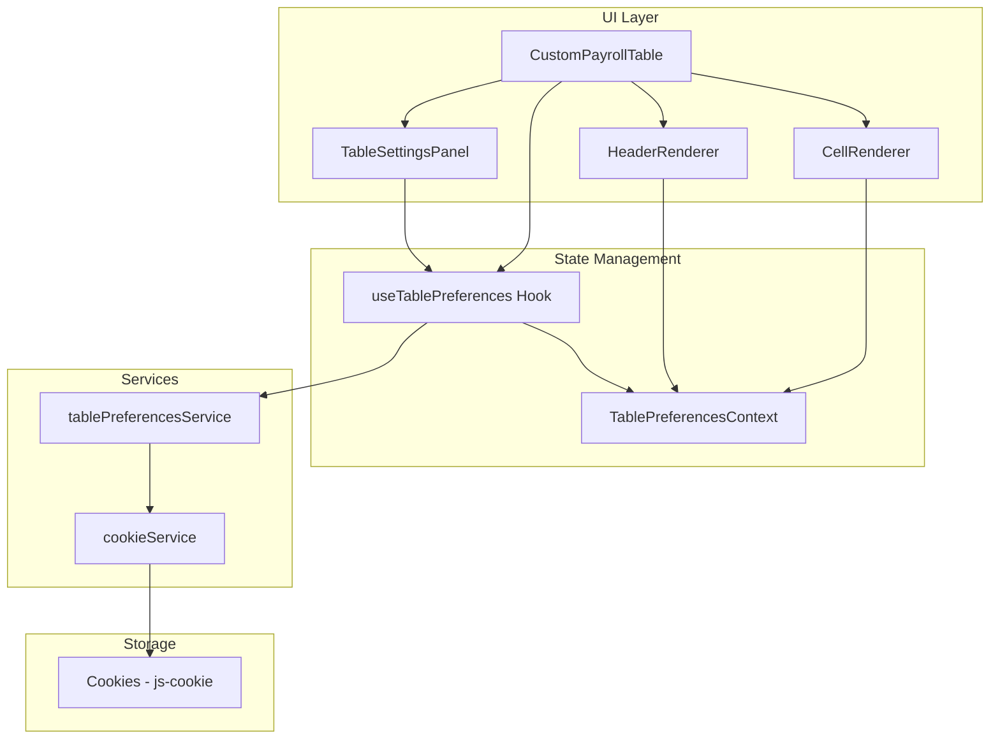

# Rencana Improvement Desain Daftar Upah

## Ringkasan
Dokumen ini merencanakan peningkatan desain untuk tabel daftar upah (payroll), dengan fokus pada:
1. **Header Group Coloring** - Warna background yang konsisten per kategori header (ABSENSI, TUNJANGAN, PREMI, dll)
2. **Scrolling Behavior Improvement** - Perbaikan perilaku scroll untuk pengalaman pengguna yang lebih baik
3. **Personalisasi via Cookies** - Kemampuan kustomisasi yang disimpan di cookies dengan fitur advanced

## Tujuan Utama
- Memudahkan user membedakan kolom berdasarkan kategori (tunjangan, premi, potongan, dll)
- Memberikan kontrol penuh atas tampilan tabel
- Menyimpan preferensi personal di cookies untuk persistensi

---

## Analisis Struktur Saat Ini

### Header Groups yang Ada
Berdasarkan analisis [`CustomPayrollTable.jsx`](frontend/src/components/CustomPayrollTable.jsx), berikut adalah struktur header groups yang ada:

| Header Group | Sub-Groups | Kolom |
|-------------|------------|-------|
| **IDENTITAS** | - | NO, NIK, NAMA |
| **PAJAK** | - | PTKP, TER, GP IDEAL, GP BAYAR, KOREKSI HK, ASTEK, BPJS KES, dll. |
| **ABSENSI** | KEHADIRAN, KETIDAKHADIRAN | AN, CUTI, SAKIT+HAID, MINGGU, NASIONAL, JUMLAH HK, TOTAL JAM |
| **PANEN** | BUNCHES, BRONDOLAN | TOTAL JANJANG, MASAK, MENGKAL, MENTAH, LEWAT MASAK, BUSUK, ABNORMAL, KG/QTY, JML TRX |
| **PENGGAJIAN** | - | UPAH DASAR, GP IDEAL, GP AKTUAL, KOREKSI HK |
| **TUNJANGAN** | BERAS, TUNJ. JABATAN, MASA KERJA, LEMBUR | RATE, JUMLAH per sub-kategori |
| **PREMI** | - | BRONDOL, dynamic premi columns, TOTAL PREMI |
| **POTONGAN UPAH KOTOR** | - | KOREKSI variations, TOTAL KOREKSI |
| **UPAH KOTOR** | - | JUMLAH |
| **POTONGAN UPAH BERSIH** | CARUMAN ASTEK, POTONGAN BPJS | PEKERJA, MAJIKAN, KESEHATAN, PENSIUN, IURAN SPSI, PPH21, PREMI PPH |
| **UPAH BERSIH** | - | JUMLAH |

### CSS Styling Saat Ini
File [`CustomPayrollTable.css`](frontend/src/styles/CustomPayrollTable.css) sudah memiliki beberapa cell-specific colors:
- `.cell-absensi` - Light blue `#f0f4ff`
- `.cell-harvest` - Light green `#f0fdf4`
- `.cell-premi` - Light yellow
- `.cell-deduction` - Light red `#fff1f2`
- `.cell-net-salary` - Dark green `#166534`

### Cookie Service
File [`cookieService.js`](frontend/src/services/cookieService.js) sudah menggunakan library `js-cookie` dengan fitur:
- Penyimpanan token dan user info
- Expiration management
- Support untuk external token

---

## Rencana Implementasi

### Phase 1: Header Group Color System

#### 1.1 Definisi Warna Default per Kategori
```javascript
const HEADER_GROUP_COLORS = {
  IDENTITAS: { bg: '#E3F2FD', text: '#1565C0', border: '#90CAF9' },      // Blue
  PAJAK: { bg: '#F3E5F5', text: '#7B1FA2', border: '#CE93D8' },          // Purple
  ABSENSI: { bg: '#E8F5E9', text: '#2E7D32', border: '#A5D6A7' },        // Green
  PANEN: { bg: '#FFF8E1', text: '#F57F17', border: '#FFE082' },          // Amber
  PENGGAJIAN: { bg: '#E0F7FA', text: '#00838F', border: '#80DEEA' },     // Cyan
  TUNJANGAN: { bg: '#FBE9E7', text: '#D84315', border: '#FFAB91' },      // Deep Orange
  PREMI: { bg: '#FFFDE7', text: '#F9A825', border: '#FFF59D' },          // Yellow
  'POTONGAN UPAH KOTOR': { bg: '#FFEBEE', text: '#C62828', border: '#EF9A9A' }, // Red
  'UPAH KOTOR': { bg: '#E8EAF6', text: '#303F9F', border: '#C5CAE9' },   // Indigo
  'POTONGAN UPAH BERSIH': { bg: '#FCE4EC', text: '#AD1457', border: '#F48FB1' }, // Pink
  'UPAH BERSIH': { bg: '#1B5E20', text: '#FFFFFF', border: '#4CAF50' }   // Dark Green (highlight)
};
```

#### 1.2 Struktur Data Personalisasi
```javascript
const defaultPersonalization = {
  headerColors: HEADER_GROUP_COLORS,
  columnVisibility: {},      // Kolom mana yang visible/hidden
  columnOrder: [],           // Urutan kolom custom
  columnWidths: {},          // Lebar kolom custom
  fontSize: 100,             // Scale factor (percentage)
  stickyColumns: ['no', 'nik', 'nama'], // Kolom yang selalu terlihat
  collapsedGroups: [],       // Header groups yang di-collapse
  scrollBehavior: {
    virtualScroll: true,     // Enable virtual scrolling
    stickyHeader: true,      // Header selalu terlihat
    stickyFooter: true       // Grand total selalu terlihat
  }
};
```

### Phase 2: Scrolling Behavior Improvement

#### 2.1 Virtual Scrolling
Implementasi virtual scrolling untuk performa optimal dengan data besar:



#### 2.2 Sticky Headers dengan Color Coding
- Header level 1 (Group) akan memiliki background color sesuai kategori
- Header level 2-4 akan mewarisi warna dengan opacity berbeda
- Border antar group dengan warna yang konsisten

#### 2.3 Horizontal Scroll Sync
- Sinkronisasi scroll horizontal antara header dan body
- Sticky columns untuk IDENTITAS selalu terlihat

### Phase 3: Personalisasi & Cookie Storage

#### 3.1 UI untuk Kustomisasi
Komponen baru untuk mengatur preferensi:

```
┌─────────────────────────────────────────────────────────────┐
│  ⚙️ Pengaturan Tampilan Daftar Upah                         │
├─────────────────────────────────────────────────────────────┤
│                                                             │
│  🎨 Warna Header Group                                      │
│  ┌─────────────────────────────────────────────────────┐   │
│  │ IDENTITAS     [████] Edit  [Reset]                  │   │
│  │ ABSENSI       [████] Edit  [Reset]                  │   │
│  │ TUNJANGAN     [████] Edit  [Reset]                  │   │
│  │ PREMI         [████] Edit  [Reset]                  │   │
│  │ POTONGAN      [████] Edit  [Reset]                  │   │
│  └─────────────────────────────────────────────────────┘   │
│                                                             │
│  📊 Visibilitas Kolom                                       │
│  ┌─────────────────────────────────────────────────────┐   │
│  │ [x] PAJAK Detail (expandable)                       │   │
│  │ [x] PANEN Detail                                   │   │
│  │ [ ] KOREKSI Detail (collapsed by default)           │   │
│  └─────────────────────────────────────────────────────┘   │
│                                                             │
│  📜 Scroll Behavior                                         │
│  ┌─────────────────────────────────────────────────────┐   │
│  │ [x] Sticky Header                                   │   │
│  │ [x] Sticky Footer (Grand Total)                     │   │
│  │ [x] Virtual Scrolling (recommended for large data)  │   │
│  └─────────────────────────────────────────────────────┘   │
│                                                             │
│  [Reset ke Default]  [Simpan ke Cookies]                   │
└─────────────────────────────────────────────────────────────┘
```

#### 3.2 Cookie Storage Structure
```javascript
// Key: payroll_table_preferences
{
  version: 1,  // For migration compatibility
  timestamp: '2026-02-17T13:00:00Z',
  preferences: {
    headerColors: { ... },
    columnVisibility: { ... },
    columnWidths: { ... },
    fontSize: 100,
    scrollBehavior: { ... }
  }
}
```

---

## File yang Perlu Dibuat/Dimodifikasi

### File Baru
1. `frontend/src/services/tablePreferencesService.js` - Service untuk mengelola preferensi tabel
2. `frontend/src/components/common/TableSettingsPanel.jsx` - UI panel untuk kustomisasi
3. `frontend/src/styles/table-settings.css` - Styling untuk panel kustomisasi
4. `frontend/src/hooks/useTablePreferences.js` - Hook untuk mengakses preferensi

### File yang Dimodifikasi
1. `frontend/src/components/CustomPayrollTable.jsx` - Integrasi sistem warna dan preferensi
2. `frontend/src/styles/CustomPayrollTable.css` - CSS untuk header group colors
3. `frontend/src/services/cookieService.js` - Tambahkan fungsi untuk preferensi tabel

---

## Diagram Arsitektur



---

## Estimasi Task Breakdown

### Task 1: Header Group Color System
- [ ] Definisikan warna default untuk setiap header group
- [ ] Buat CSS classes untuk setiap warna group
- [ ] Modifikasi header rendering untuk apply warna
- [ ] Test dengan berbagai kombinasi kolom

### Task 2: Table Preferences Service
- [ ] Buat service untuk baca/tulis preferensi ke cookies
- [ ] Implementasi default values
- [ ] Implementasi merge dengan user preferences
- [ ] Handle migration untuk versi preferences

### Task 3: Settings Panel UI
- [ ] Buat komponen TableSettingsPanel
- [ ] UI untuk mengubah warna header
- [ ] UI untuk mengatur visibilitas kolom
- [ ] UI untuk scroll behavior settings
- [ ] Integrasi dengan CustomPayrollTable

### Task 4: Scrolling Improvements
- [ ] Implementasi virtual scrolling (opsional, jika diperlukan)
- [ ] Perbaikan sticky header behavior
- [ ] Horizontal scroll sync
- [ ] Performance optimization

### Task 5: Integration & Testing
- [ ] Integrasi semua komponen
- [ ] Test dengan data real
- [ ] Cross-browser testing
- [ ] Performance testing

---

## Detail Implementasi

### 1. Header Group Color System

Setiap header group akan memiliki warna background yang konsisten dari level 1 sampai level 4:

```
┌──────────────────────────────────────────────────────────────────────────┐
│ IDENTITAS │  ABSENSI (Hijau)  │ TUNJANGAN (Orange) │ PREMI (Kuning) │...│
├───────────┼───────────────────┼────────────────────┼────────────────┼───┤
│           │ KEHADIRAN │ KETIDAK│ BERAS  │ JABATAN  │                │   │
│ NIK│NAMA  ├───────────┼────────┼────────┼──────────┤  BRONDOL │ ... │   │
│    │      │ AN │CUTI  │SAKIT   │RATE│JML│RATE│JML │          │     │   │
├────┼──────┼───┼──────┼────────┼────┼───┼────┼────┼──────────┼─────┼───┤
│ 1  │Ahmad │ 26│  0   │  0     │ 2  │10k│ 0  │ 0  │  150,000 │ ... │   │
└────┴──────┴───┴──────┴────────┴────┴───┴────┴────┴──────────┴─────┴───┘
```

### 2. Advanced Personalization Features

#### 2.1 Color Picker per Header Group
User dapat memilih warna custom untuk setiap header group melalui color picker UI.

#### 2.2 Column Visibility Toggle
User dapat menyembunyikan/menampilkan kolom tertentu.

#### 2.3 Column Width Adjustment
User dapat mengubah lebar kolom dan disimpan di cookies.

#### 2.4 Font Size Scaling
User dapat memperbesar/memperkecil font size tabel.

#### 2.5 Sticky Columns Configuration
User dapat mengatur kolom mana yang selalu terlihat (sticky).

### 3. Cookie Storage Structure

```javascript
// Key: payroll_table_preferences
{
  version: 1,
  timestamp: '2026-02-17T13:00:00Z',
  preferences: {
    // Warna per header group
    headerColors: {
      IDENTITAS: { bg: '#E3F2FD', text: '#1565C0' },
      ABSENSI: { bg: '#E8F5E9', text: '#2E7D32' },
      TUNJANGAN: { bg: '#FBE9E7', text: '#D84315' },
      PREMI: { bg: '#FFFDE7', text: '#F9A825' },
      // ... dst
    },
    // Kolom yang visible
    columnVisibility: {
      'pajak_expanded': false,
      'panen_detail': true,
      // ... dst
    },
    // Lebar kolom custom
    columnWidths: {
      'nama': 180,
      'nik': 60,
      // ... dst
    },
    // Font scale
    fontSize: 100, // percentage
    // Sticky columns
    stickyColumns: ['no', 'nik', 'nama'],
    // Scroll behavior
    scrollBehavior: {
      virtualScroll: true,
      stickyHeader: true,
      stickyFooter: true
    }
  }
}
```

---

## Task Breakdown untuk Implementasi

### Task 1: Header Group Color System
- [ ] Definisikan warna default untuk setiap header group
- [ ] Buat CSS classes dinamis untuk warna group
- [ ] Modifikasi header rendering untuk apply warna berdasarkan group
- [ ] Apply warna ke body cells sesuai group-nya

### Task 2: Table Preferences Service
- [ ] Buat `tablePreferencesService.js` untuk manage cookies
- [ ] Implementasi fungsi: save, load, reset preferences
- [ ] Implementasi merge dengan default values
- [ ] Handle versioning untuk migration

### Task 3: Settings Panel UI
- [ ] Buat komponen `TableSettingsPanel.jsx`
- [ ] Tab 1: Color Settings (color picker per group)
- [ ] Tab 2: Column Visibility (toggle per kolom/group)
- [ ] Tab 3: Display Settings (font size, sticky columns)
- [ ] Preview changes sebelum save

### Task 4: Scrolling Improvements
- [ ] Optimize sticky header performance
- [ ] Implement smooth horizontal scroll
- [ ] Fix scroll sync antara header dan body
- [ ] Add scroll position indicator

### Task 5: Integration
- [ ] Integrasi dengan `CustomPayrollTable.jsx`
- [ ] Load preferences on mount
- [ ] Auto-save on changes
- [ ] Reset to default functionality

---

## Next Steps

Rencana ini sudah siap untuk implementasi. Apakah Anda setuju dengan rencana ini? Jika setuju, saya akan:
1. Switch ke Code mode
2. Mulai implementasi Task 1 (Header Group Color System)
3. Lanjutkan secara bertahap sesuai prioritas
