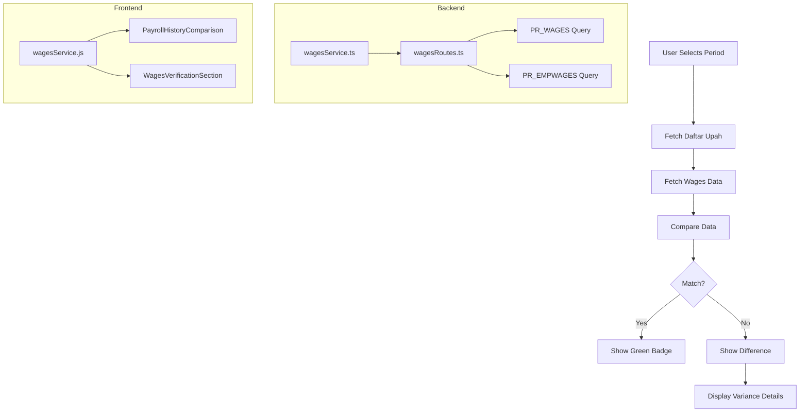

# Payroll History & Wages Comparison Feature Plan

## Overview

Fitur untuk menampilkan riwayat daftar upah dengan verifikasi terhadap tabel wages (PR_WAGES/PR_EMPWAGES) untuk memastikan kecocokan upah bersih yang diterima karyawan setiap bulan.

## Current System Analysis

### Existing Components
- **Backend**: `historyDatabaseService.ts`, `historyRoutes.ts`, `employee.ts`
- **Frontend**: `SalaryHistoryTable.jsx`, `SalaryHistoryTimeline.jsx`, `EmployeeHistoryPage.jsx`
- **Database Tables**: 
  - `payroll_history_master` - Header/summary per periode
  - `payroll_history_detail` - Detail per karyawan
  - `PR_WAGES` - Data wages yang sudah dibayar
  - `PR_EMPWAGES` - Detail wages per karyawan

### Data Flow
```
PR_TASKREG/PR_ADTRANS → Calculated Daftar Upah → PR_WAGES/PR_EMPWAGES (Paid)
                              ↓                           ↓
                    payroll_history_detail        Wages Comparison
```

## Implementation Plan

### Phase 1: Backend API Development

#### 1.1 Create Wages Service
**File**: `backend/src/services/wagesService.ts`

```typescript
// Functions needed:
- getWagesByPeriod(month, year, division?) - Get wages data for period
- getWagesByEmployee(empCode, month, year) - Get employee wages
- compareWagesWithPayroll(payrollData, wagesData) - Compare and return differences
```

#### 1.2 Create Wages Routes
**File**: `backend/src/api/wagesRoutes.ts`

**Endpoints**:
- `GET /payroll/wages/period/:month/:year` - Get wages for period
- `GET /payroll/wages/employee/:empCode/history` - Get employee wages history
- `GET /payroll/wages/comparison/:month/:year` - Get comparison data

#### 1.3 Database Query for PR_WAGES
```sql
-- Get wages data for period
SELECT 
    w.*,
    e.EMP_NAME,
    e.NIK,
    g.GANG_CODE,
    g.GANG_DESC,
    d.DEPT_CODE as DIVISION_CODE
FROM PR_WAGES w
JOIN PR_EMPWAGES ew ON w.WAGES_NO = ew.WAGES_NO
JOIN HR_EMPLOYEE e ON ew.EMP_CODE = e.EMP_CODE
JOIN HR_GANGLN g ON e.GANG_CODE = g.GANG_CODE
WHERE MONTH(w.WAGES_DATE) = @month 
  AND YEAR(w.WAGES_DATE) = @year
```

### Phase 2: Frontend Development

#### 2.1 Create Wages Service
**File**: `frontend/src/services/wagesService.js`

```javascript
// API functions:
- fetchWagesByPeriod(token, month, year, division)
- fetchWagesComparison(token, month, year)
- fetchEmployeeWagesHistory(token, empCode, months)
```

#### 2.2 Create PayrollHistoryComparison Component
**File**: `frontend/src/components/PayrollHistoryComparison.jsx`

**Features**:
- Month/Year selector
- Division filter
- Comparison table with columns:
  - Employee info (NIK, Nama, Gang)
  - Daftar Upah columns (HK, Gaji Pokok, Tunjangan, Premi, Potongan, Upah Bersih)
  - Wages columns (Paid HK, Paid Amount)
  - Difference columns (HK Diff, Amount Diff)
  - Verification status (✓ Match / ⚠ Difference)

#### 2.3 Create WagesVerificationSection Component
**File**: `frontend/src/components/WagesVerificationSection.jsx`

**Features**:
- Summary KPI cards showing:
  - Total employees matched
  - Total employees with differences
  - Total variance amount
- Detailed breakdown of differences

#### 2.4 Update Existing Components

**File**: `frontend/src/components/employee/SalaryHistoryTable.jsx`
- Add wages comparison column
- Show verification badge per period

**File**: `frontend/src/components/employee/SalaryHistoryTimeline.jsx`
- Add wages verification indicator
- Show comparison popup on click

### Phase 3: UI/UX Design

#### 3.1 Comparison Table Layout
```
+------------------------------------------------------------------+
| IDENTITAS      | DAFTAR UPAH           | WAGES        | SELISIH  |
+------------------------------------------------------------------+
| NIK | Nama|Gang| HK | Gaji | Upah Bersih | HK | Amount  | HK | Rp |
+------------------------------------------------------------------+
| ... | ... | ...| ... | ...  | ...         | ...| ...     | ...| ...|
+------------------------------------------------------------------+
```

#### 3.2 Verification Status Indicators
- ✓ Green badge: Match (tolerance: Rp 1)
- ⚠ Yellow badge: Minor difference (< Rp 10,000)
- ❌ Red badge: Significant difference (>= Rp 10,000)

#### 3.3 Styling
**File**: `frontend/src/styles/wages-comparison.css`

### Phase 4: Integration

#### 4.1 Add to Report Page
- Add "Riwayat & Verifikasi" tab in Report.jsx
- Show comparison view when historical period selected

#### 4.2 Add to Employee Detail
- Add wages verification section in EmployeeHistoryPage.jsx
- Show per-period verification status

## Technical Specifications

### API Response Format

#### GET /payroll/wages/comparison/:month/:year
```json
{
  "success": true,
  "period": {
    "month": 1,
    "year": 2026,
    "label": "Januari 2026"
  },
  "summary": {
    "total_employees": 150,
    "matched": 145,
    "with_differences": 5,
    "total_variance": 250000
  },
  "data": [
    {
      "emp_code": "EMP001",
      "nik": "12345",
      "nama": "John Doe",
      "gang_code": "H1H1",
      "division_code": "H1",
      "daftar_upah": {
        "jumlah_hk": 25,
        "gaji_pokok": 3500000,
        "total_tunjangan": 500000,
        "total_premi": 200000,
        "total_potongan": 300000,
        "upah_bersih": 3900000
      },
      "wages": {
        "wages_no": "WJ-2026-001",
        "wages_date": "2026-01-25",
        "jumlah_hk": 25,
        "upah_bersih": 3900000
      },
      "comparison": {
        "hk_match": true,
        "amount_match": true,
        "hk_difference": 0,
        "amount_difference": 0,
        "status": "MATCH"
      }
    }
  ]
}
```

### Database Schema Reference

#### PR_WAGES Table Structure (Estimated)
| Column | Type | Description |
|--------|------|-------------|
| WAGES_NO | varchar | Wages document number |
| WAGES_DATE | date | Payment date |
| PERIOD_MONTH | int | Period month |
| PERIOD_YEAR | int | Period year |
| DIVISION_CODE | varchar | Division code |
| TOTAL_EMPLOYEES | int | Total employees |
| TOTAL_AMOUNT | decimal | Total wages amount |

#### PR_EMPWAGES Table Structure (Estimated)
| Column | Type | Description |
|--------|------|-------------|
| WAGES_NO | varchar | FK to PR_WAGES |
| EMP_CODE | varchar | Employee code |
| JUMLAH_HK | decimal | Work days paid |
| UPAH_BERSIH | decimal | Net wages paid |
| PAYMENT_STATUS | varchar | Payment status |

## Implementation Steps

### Step 1: Backend Implementation
1. Create `wagesService.ts` with database queries
2. Create `wagesRoutes.ts` with API endpoints
3. Add wages comparison logic
4. Test API endpoints

### Step 2: Frontend Service
1. Create `wagesService.js` for API calls
2. Add error handling and caching

### Step 3: UI Components
1. Create `PayrollHistoryComparison.jsx`
2. Create `WagesVerificationSection.jsx`
3. Add styling in `wages-comparison.css`

### Step 4: Integration
1. Add to Report.jsx as new tab
2. Update EmployeeHistoryPage.jsx
3. Update SalaryHistoryTable.jsx

### Step 5: Testing
1. Test with real data
2. Verify comparison accuracy
3. Test edge cases (missing data, partial matches)

## Mermaid Diagram



## Questions for Clarification

1. **PR_WAGES/PR_EMPWAGES Schema**: Apakah struktur tabel ini sudah benar? Bisa share sample data atau schema?

2. **Tolerance Level**: Berapa toleransi untuk perbedaan yang dianggap MATCH? (Rp 1, Rp 100, Rp 1000?)

3. **Display Location**: Fitur ini ditampilkan di mana?
   - Tab baru di Report page?
   - Halaman terpisah?
   - Modal di employee detail?

4. **Historical Data**: Apakah PR_WAGES menyimpan history? Atau hanya data periode berjalan?

5. **Comparison Scope**: 
   - Per karyawan saja?
   - Per gang/divisi juga?
   - Summary level comparison?

## Next Steps

Setelah klarifikasi:
1. Finalize database schema untuk PR_WAGES
2. Implement backend API
3. Build frontend components
4. Integration testing
