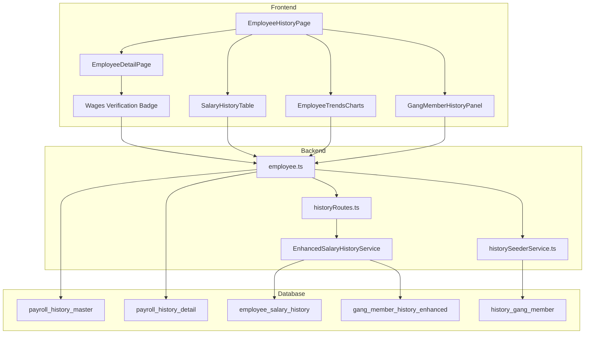

# Rencana Implementasi Riwayat Gaji Karyawan (Employee Salary History)

## Ringkasan Eksekutif

Dokumen ini berisi rencana implementasi fitur riwayat gaji komprehensif yang mencakup:
1. Penyimpanan data daftar upah lengkap per karyawan per periode
2. Tracking keanggotaan gang (gang member history)
3. Verifikasi upah bersih dengan data wages
4. UI/UX yang lebih baik dengan statistik dan grafik
5. Opsi agregasi dan seed history

## Kondisi Saat Ini

### Komponen yang Sudah Ada:
- `EmployeeHistoryPage` - Halaman dengan tab: Current Period, Salary History, Trends, Comparison
- `SalaryHistoryTable` - Tabel riwayat gaji
- `EmployeeTrendsCharts` - Grafik tren karyawan
- `SalaryHistoryTimeline` - Timeline riwayat gaji
- `PeriodComparison` - Perbandingan antar periode
- Backend history routes (`/payroll/history`)
- Employee history endpoint (`/payroll/employee/:emp_code/history`)
- Skema database history (`history_database_schema.md`)
- `historySeederService` untuk seeding data

### Masalah yang Perlu Diperbaiki:
1. **Riwayat gaji tidak muncul/tidak lengkap** - Data yang ditampilkan tidak selengkap daftar upah
2. **Desain halaman detail karyawan kurang baik** - UI perlu diperbaiki
3. **Tidak ada verifikasi wages** - PerluUI untuk membandingkan hasil perhitungan dengan data wages
4. **Gang member history terbatas** - Perlu tracking yang lebih komprehensif

---

## Plan 1: Pemahaman Struktur Data dan Verifikasi

### 1.1 Analisis Struktur Daftar Upah (Daftar Upah)
Fungsi utama: memahami field-field apa saja yang ada di daftar upah agar bisa disimpan di history

**Field-field utama yang perlu disimpan per karyawan per periode:**

| Kategori | Field | Tipe |
|----------|-------|------|
| Identitas | emp_code, nik, nama, gender, gang_code, division_code, loc_code | string |
| Absensi | jumlah_hk, hari_kerja, cuti_tahunan, cuti_sakit, cuti_minggu, cuti_nasional | decimal |
| Upah Pokok | upah_dasar, upah_pokok, gaji_pokok, koreksi_hk | decimal |
| Tunjangan | beras_rate/jumlah, jabatan_rate/jumlah, masa_kerja_tahun/rate/jumlah, total_tunjangan | decimal/int |
| Lembur | lembur_jam, lembur_rate, lembur_jumlah, lembur_records (JSON) | decimal |
| Premi | premi_brondol, premi_prunning, premi_insentif, premi_kinerja, dynamic_premi_data (JSON) | decimal |
| Potongan | pot_spsi, pot_pph21, pot_koreksi, pot_bpjs_kesehatan, pot_bpjs_pensiun, dynamic_potongan_data (JSON) | decimal |
| Total | jumlah_upah_kotor, pph21_ter, upah_bersih | decimal |
| Metadata | task_code, task_desc, shortage_details | string/JSON |

### 1.2 Verifikasi Wages (Upah Bersih)
Tambahkan UI verifikasi bahwa hasil perhitungan upah bersih = wages.upah_bersih

**Logika verifikasi:**
```
IF wages.upah_bersih EXISTS:
    calculated_upah_bersih = SUM(all earnings) - SUM(all deductions)
    IF ABS(calculated_upah_bersih - wages.upah_bersih) < 1:
        status = "VERIFIED" ✅
    ELSE:
        status = "MISMATCH" ⚠️
        difference = calculated_upah_bersih - wages.upah_bersih
ELSE:
    status = "NO_WAGES_DATA" ℹ️
```

---

## Plan 2: Skema Database History (Enhancement)

### 2.1 Tabel yang Sudah Ada (dari history_database_schema.md)

#### `payroll_history_master`
- Summary per periode per gang
- Total employees, total HK, total upah, dll

#### `payroll_history_detail`
- Detail per karyawan per periode
- Hampir semua field dari daftar upah

#### `history_gang_member`
- Tracking keanggotaan gang per periode

#### `history_taskreg` & `history_adtrans`
- Transaksi detail (absensi, tunjangan, potongan)

### 2.2 Enhancement yang Diperlukan

**Tabel Baru: `employee_salary_history`**
```sql
CREATE TABLE [dbo].[employee_salary_history] (
    [id] [bigint] IDENTITY(1,1) NOT NULL,
    [emp_code] [varchar](50) NOT NULL,
    [period_month] [int] NOT NULL,
    [period_year] [int] NOT NULL,
    
    -- Complete salary data (mirrors daftar upah)
    [nik] [varchar](50) NULL,
    [nama] [nvarchar](255) NULL,
    [gender] [varchar](10) NULL,
    [gang_code] [varchar](50) NOT NULL,
    [division_code] [varchar](50) NOT NULL,
    [loc_code] [varchar](50) NULL,
    [status_ptkp] [varchar](20) NULL,
    [kategori_ter] [varchar](20) NULL,
    
    -- Absensi
    [hari_kerja] [decimal](18,2) NOT NULL DEFAULT 0,
    [jumlah_hk] [decimal](18,2) NOT NULL DEFAULT 0,
    [cuti_tahunan] [decimal](18,2) NOT NULL DEFAULT 0,
    [cuti_sakit] [decimal](18,2) NOT NULL DEFAULT 0,
    [cuti_minggu] [decimal](18,2) NOT NULL DEFAULT 0,
    [cuti_nasional] [decimal](18,2) NOT NULL DEFAULT 0,
    
    -- Upah
    [upah_dasar] [decimal](18,2) NOT NULL DEFAULT 0,
    [upah_pokok] [decimal](18,2) NOT NULL DEFAULT 0,
    [gaji_pokok] [decimal](18,2) NOT NULL DEFAULT 0,
    [koreksi_hk] [decimal](18,2) NOT NULL DEFAULT 0,
    
    -- Tunjangan
    [beras_rate] [decimal](18,2) NOT NULL DEFAULT 0,
    [beras_jumlah] [decimal](18,2) NOT NULL DEFAULT 0,
    [jabatan_rate] [decimal](18,2) NOT NULL DEFAULT 0,
    [jabatan_jumlah] [decimal](18,2) NOT NULL DEFAULT 0,
    [masa_kerja_tahun] [int] NOT NULL DEFAULT 0,
    [masa_kerja_rate] [decimal](18,2) NOT NULL DEFAULT 0,
    [masa_kerja_jumlah] [decimal](18,2) NOT NULL DEFAULT 0,
    [lembur_jam] [decimal](18,2) NOT NULL DEFAULT 0,
    [lembur_rate] [decimal](18,2) NOT NULL DEFAULT 0,
    [lembur_jumlah] [decimal](18,2) NOT NULL DEFAULT 0,
    [total_tunjangan] [decimal](18,2) NOT NULL DEFAULT 0,
    
    -- Premi
    [premi_brondol] [decimal](18,2) NOT NULL DEFAULT 0,
    [premi_prunning] [decimal](18,2) NOT NULL DEFAULT 0,
    [premi_insentif] [decimal](18,2) NOT NULL DEFAULT 0,
    [premi_kinerja] [decimal](18,2) NOT NULL DEFAULT 0,
    [premi_pph] [decimal](18,2) NOT NULL DEFAULT 0,
    [total_premi] [decimal](18,2) NOT NULL DEFAULT 0,
    [dynamic_premi_data] [nvarchar](max) NULL,
    
    -- Potongan
    [pot_spsi] [decimal](18,2) NOT NULL DEFAULT 0,
    [pot_pph21] [decimal](18,2) NOT NULL DEFAULT 0,
    [pot_koreksi] [decimal](18,2) NOT NULL DEFAULT 0,
    [pot_bpjs_kesehatan_pekerja] [decimal](18,2) NOT NULL DEFAULT 0,
    [pot_bpjs_kesehatan_majikan] [decimal](18,2) NOT NULL DEFAULT 0,
    [pot_bpjs_pensiun_pekerja] [decimal](18,2) NOT NULL DEFAULT 0,
    [pot_bpjs_pensiun_majikan] [decimal](18,2) NOT NULL DEFAULT 0,
    [pot_astek_pekerja] [decimal](18,2) NOT NULL DEFAULT 0,
    [pot_astek_majikan] [decimal](18,2) NOT NULL DEFAULT 0,
    [total_potongan] [decimal](18,2) NOT NULL DEFAULT 0,
    [dynamic_potongan_data] [nvarchar](max) NULL,
    
    -- Total
    [jumlah_upah_kotor] [decimal](18,2) NOT NULL DEFAULT 0,
    [pph21_ter] [decimal](18,2) NOT NULL DEFAULT 0,
    [upah_bersih] [decimal](18,2) NOT NULL DEFAULT 0,
    
    -- Wages Verification
    [wages_upah_bersih] [decimal](18,2) NULL,
    [verification_status] [varchar](20) NULL,  -- 'VERIFIED', 'MISMATCH', 'NO_DATA'
    [verification_difference] [decimal](18,2) NULL,
    
    -- Audit
    [created_at] [datetime] NOT NULL DEFAULT GETDATE(),
    [source_history_id] [varchar](50) NULL,
    
    CONSTRAINT [PK_employee_salary_history] PRIMARY KEY CLUSTERED ([id] ASC),
    CONSTRAINT [UQ_employee_salary_history] UNIQUE NONCLUSTERED ([emp_code], [period_month], [period_year])
);

CREATE NONCLUSTERED INDEX [IX_employee_salary_history_emp] 
    ON [dbo].[employee_salary_history] ([emp_code]);
    
CREATE NONCLUSTERED INDEX [IX_employee_salary_history_period] 
    ON [dbo].[employee_salary_history] ([period_year], [period_month]);
```

**Tabel Baru: `gang_member_history_enhanced`**
```sql
CREATE TABLE [dbo].[gang_member_history_enhanced] (
    [id] [bigint] IDENTITY(1,1) NOT NULL,
    [gang_code] [varchar](50) NOT NULL,
    [gang_description] [nvarchar](255) NULL,
    [division_code] [varchar](50) NOT NULL,
    [loc_code] [varchar](50) NULL,
    [period_month] [int] NOT NULL,
    [period_year] [int] NOT NULL,
    
    -- Employee yang ada di gang ini pada periode tersebut
    [emp_code] [varchar](50) NOT NULL,
    [emp_name] [nvarchar](255) NULL,
    [join_date] [date] NULL,
    [is_active] [bit] NOT NULL DEFAULT 1,
    
    -- Posisi/jabatan di gang
    [role] [nvarchar](100) NULL,
    
    -- Metadata
    [created_at] [datetime] NOT NULL DEFAULT GETDATE(),
    
    CONSTRAINT [PK_gang_member_history_enhanced] PRIMARY KEY CLUSTERED ([id] ASC)
);

CREATE NONCLUSTERED INDEX [IX_gang_member_history_gang_period] 
    ON [dbo].[gang_member_history_enhanced] ([gang_code], [period_year], [period_month]);
    
CREATE NONCLUSTERED INDEX [IX_gang_member_history_emp_period] 
    ON [dbo].[gang_member_history_enhanced] ([emp_code], [period_year], [period_month]);
```

---

## Plan 3: Test Cases

### 3.1 Unit Tests

#### Test: Verifikasi Upah Bersih
```javascript
describe('Salary Verification', () => {
    test('should verify wages matches calculated net salary', () => {
        // Given: employee with complete salary data
        const salaryData = {
            jumlah_upah_kotor: 5000000,
            total_potongan: 500000,
            upah_bersih: 4500000
        };
        
        const wagesData = {
            upah_bersih: 4500000
        };
        
        // When: verifying
        const result = verifySalary(salaryData, wagesData);
        
        // Then: should be verified
        expect(result.status).toBe('VERIFIED');
    });
    
    test('should detect mismatch between wages and calculated', () => {
        // Given: salary data differs from wages
        const salaryData = {
            jumlah_upah_kotor: 5000000,
            total_potongan: 500000,
            upah_bersih: 4500000
        };
        
        const wagesData = {
            upah_bersih: 4400000  // Different!
        };
        
        // When: verifying
        const result = verifySalary(salaryData, wagesData);
        
        // Then: should show mismatch
        expect(result.status).toBe('MISMATCH');
        expect(result.difference).toBe(100000);
    });
});
```

#### Test: Gang Member History
```javascript
describe('Gang Member History', () => {
    test('should get all gang members for a period', async () => {
        // Given: saved gang member history
        const gangCode = 'H1A1';
        const period = { month: 1, year: 2026 };
        
        // When: getting members
        const members = await getGangMembers(gangCode, period);
        
        // Then: should return all members
        expect(members).toHaveLength(10);
        expect(members[0]).toHaveProperty('emp_code');
        expect(members[0]).toHaveProperty('emp_name');
    });
    
    test('should get employee gang history across periods', async () => {
        // Given: employee code
        const empCode = 'EMP001';
        
        // When: getting history
        const history = await getEmployeeGangHistory(empCode);
        
        // Then: should return all periods
        expect(history).toHaveLength(12);
        expect(history[0].gang_code).toBeDefined();
    });
});
```

### 3.2 Integration Tests

```javascript
describe('Employee Salary History Integration', () => {
    test('should save and retrieve complete salary history', async () => {
        // Given: employee salary data
        const salaryData = createCompleteSalaryData();
        
        // When: saving to history
        const saved = await saveSalaryHistory(salaryData);
        
        // Then: should be saved with all fields
        expect(saved.id).toBeDefined();
        
        // And: should be retrievable
        const retrieved = await getSalaryHistory(saved.emp_code);
        expect(retrieved).toHaveAllSalaryFields();
    });
    
    test('should aggregate salary data for employee', async () => {
        // Given: multiple months of salary history
        
        // When: aggregating
        const aggregated = await aggregateSalaryHistory(empCode, {
            startMonth: 1,
            startYear: 2025,
            endMonth: 12,
            endYear: 2025
        });
        
        // Then: should have yearly totals
        expect(aggregated.total_upah_bersih).toBeDefined();
        expect(aggregated.average_upah_bersih).toBeDefined();
        expect(aggregated.total_hk).toBeDefined();
    });
});
```

---

## Plan 4: Implementasi UI

### 4.1 Enhanced EmployeeDetailPage

**Perubahan yang diperlukan:**
1. Tambah semua field dari daftar upah yang belum ada
2. Tambah verifikasi wages dengan UI indicator
3. Perbaiki desain agar lebih profesional

**Struktur Baru:**
```
EmployeeDetailPage
├── Payslip Section (Enhanced)
│   ├── Employee Info
│   ├── Earnings (Complete)
│   │   ├── Gaji Pokok
│   │   ├── Tunjangan (Beras, Jabatan, Masa Kerja, Lainnya)
│   │   ├── Lembur
│   │   └── Premi (Brondol, Prunning, Insentif, Kinerja, Dynamic)
│   ├── Deductions (Complete)
│   │   ├── Potongan Upah Kotor (Koreksi)
│   │   ├── Potongan Upah Bersih (BPJS, Astek, SPSI, PPh21, Dynamic)
│   │   └── Total Potongan
│   └── Take Home Pay + Wages Verification Badge
├── Attendance Matrix
├── Overtime Matrix
├── Harvest Matrix (if applicable)
├── Thumbprint Verification
└── Salary History Section
    ├── Quick Stats (Average, Total, Min, Max)
    ├── Salary History Table (Complete columns from daftar upah)
    └── Trends Charts
```

### 4.2 Wages Verification UI

```jsx
<div className="wages-verification">
    {verificationStatus === 'VERIFIED' && (
        <div className="verification-badge verified">
            ✅ Terverifikasi - Sesuai dengan data wages
        </div>
    )}
    {verificationStatus === 'MISMATCH' && (
        <div className="verification-badge mismatch">
            ⚠️ Selisih: {formatCurrency(difference)}
        </div>
    )}
    {verificationStatus === 'NO_DATA' && (
        <div className="verification-badge no-data">
            ℹ️ Data wages tidak tersedia
        </div>
    )}
</div>
```

### 4.3 Gang Member History UI

**New Component: GangMemberHistoryPanel**
```jsx
function GangMemberHistoryPanel({ gangCode, period }) {
    // Show all employees who were in this gang during the period
    return (
        <div className="gang-member-history">
            <h4>👥 Anggota Gang {gangCode}</h4>
            <p className="period-label">{getMonthName(period.month)} {period.year}</p>
            <table>
                <thead>
                    <tr>
                        <th>NIK</th>
                        <th>Nama</th>
                        <th>Posisi</th>
                        <th>Tanggal Masuk</th>
                    </tr>
                </thead>
                <tbody>
                    {members.map(member => (
                        <tr key={member.emp_code}>
                            <td>{member.emp_code}</td>
                            <td>{member.emp_name}</td>
                            <td>{member.role}</td>
                            <td>{formatDate(member.join_date)}</td>
                        </tr>
                    ))}
                </tbody>
            </table>
        </div>
    );
}
```

### 4.4 Employee Salary History Page

**Enhanced features:**
1. More complete data columns (matching daftar upah)
2. Sortable columns
3. Filter by period range
4. Export to Excel
5. Quick statistics cards

---

## Plan 5: Backend API Enhancements

### 5.1 New Endpoints Needed

```typescript
// Get employee salary history with complete data
GET /payroll/employee/:emp_code/salary-history
    ? months=12
    & start_month=1
    & start_year=2025
    & end_month=12
    & end_year=2025

// Get gang members for a specific period
GET /payroll/gang/:gang_code/members
    ? month=1
    & year=2026

// Get employee gang assignment history
GET /payroll/employee/:emp_code/gang-history

// Aggregate salary data
POST /payroll/employee/:emp_code/aggregate
{
    "start_month": 1,
    "start_year": 2025,
    "end_month": 12,
    "end_year": 2025,
    "group_by": "month" | "year" | "gang"
}

// Seed history for a period (enhanced)
POST /payroll/history/seed-enhanced
{
    "period_month": 1,
    "period_year": 2026,
    "division_code": "H1",
    "include_wages_verification": true,
    "include_gang_members": true
}
```

### 5.2 Enhanced Salary History Service

```typescript
class EnhancedSalaryHistoryService {
    async getCompleteSalaryHistory(empCode: string, options: HistoryOptions): Promise<CompleteSalaryRecord[]>;
    
    async verifyWithWages(salaryData: SalaryData): Promise<VerificationResult>;
    
    async aggregateSalaryHistory(empCode: string, options: AggregateOptions): Promise<AggregatedData>;
    
    async saveSalaryHistoryWithVerification(salaryData: SalaryData[]): Promise<SaveResult>;
}
```

---

## Plan 6: Urutan Implementasi

### Fase 1: Foundation (Week 1)
1. Create database tables (employee_salary_history, gang_member_history_enhanced)
2. Update historySeederService untuk menyimpan data lengkap
3. Add wages verification logic

### Fase 2: Backend (Week 2)
1. Add new API endpoints
2. Enhance existing employee history endpoint
3. Add gang member history endpoints

### Fase 3: Frontend - Core (Week 3)
1. Enhance EmployeeDetailPage dengan semua field daftar upah
2. Add wages verification UI
3. Fix SalaryHistoryTable dengan data lengkap

### Fase 4: Frontend - Gang History (Week 4)
1. Create GangMemberHistoryPanel component
2. Add gang history to employee detail
3. Add ability to view past gang members

### Fase 5: Frontend - Statistics & Charts (Week 5)
1. Enhance EmployeeTrendsCharts
2. Add more statistics
3. Improve visualizations

### Fase 6: Testing & Polish (Week 6)
1. Write tests
2. Fix bugs
3. UI/UX improvements

---

## Diagram Arsitektur



---

## Kesimpulan

Rencana ini mencakup:
1. ✅ Penyimpanan data daftar upah lengkap per karyawan per periode
2. ✅ Tracking keanggotaan gang yang lebih komprehensif
3. ✅ Verifikasi upah bersih dengan data wages
4. ✅ UI/UX yang lebih baik dengan statistik dan grafik
5. ✅ Opsi agregasi dan seed history

Implementasi akan dilakukan secara bertahap dimulai dari Foundation hingga Testing & Polish.
