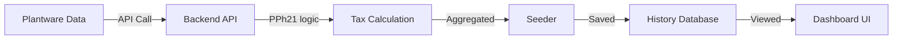

# Alur Kerja Pengguna (End-to-End Workflow)

Dokumen ini menjelaskan bagaimana pengguna (HR/Admin) menggunakan sistem ini dari awal hingga akhir periode penggajian.

---

## Tahap 1: Persiapan Awal Bulan
1.  **Login**: Admin masuk ke dashboard menggunakan akun JWT-based.
2.  **Cek Master Data**: Memastikan data karyawan (PTKP, Jabatan, Status Kerja) sudah diperbarui di database Plantware.

---

## Tahap 2: Proses Laporan Harian/Mingguan (Monitoring)
1.  **Akses Menu Payroll**: Admin memilih Divisi (misal: PG1A) dan Bulan/Tahun.
2.  **Live Grid Analysis**: Menggunakan `CustomPayrollTable` (Frontend) untuk melihat:
    - Apakah ada HK yang kurang (Kurang Jam).
    - Apakah ada premi yang salah catat.
    - Meninjau perhitungan lembur yang otomatis dikalkulasi oleh `lemburCalculator`.

---

## Tahap 3: Akhir Bulan & Agregasi (Closing)
Setelah data di lapangan (Plantware) sudah final (Fix), admin menjalankan proses Agregasi:
1.  **Running Seeder**: Admin atau sistem otomatis menjalankan `aggregation_seeder.py`.
2.  **Data Processing**:
    - Backend API menghitung Gaji Bersih dan Pajak PPh21 TER secara final.
    - Seeder menyerap data tersebut dan menyimpannya ke `extend_db_ptrj` (Snapshot).
3.  **Verifikasi Agregasi**: Memastikan Grand Total di Frontend Dashboard sudah sama dengan total di tabel Agregasi History.

---

## Tahap 4: Pelaporan & Pajak (Reporting)
1.  **Cetak Daftar Upah**: Admin mengekspor laporan akhir dari AG Grid ke format PDF/HTML untuk ditandatangani.
2.  **Laporan Pajak**: Mengunduh rekap PPh21 yang sudah dikategorikan berdasarkan TER (A, B, C) untuk diserahkan ke bagian keuangan/pajak.
3.  **Analisis Cost**: Menggunakan modul **Comparison Summary** (khusus untuk Pabrik) untuk melihat apakah biaya gaji bulan ini sebanding dengan tonase TBS yang dihasilkan.

---

## Ringkasan Perjalanan Data

## Apa yang Harus Dilakukan Jika Ada Kesalahan?
- Jika angka gaji salah: Perbaiki data absensi atau premi di database **Plantware**.
- Jika pajak salah: Periksa status PTKP karyawan di database **Plantware** atau update file `rule_TER_pajak.json`.
- Setelah perbaikan: Jalankan ulang proses **Agregasi Seeder** untuk memperbarui data history.
